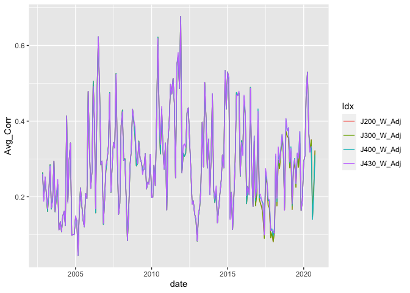
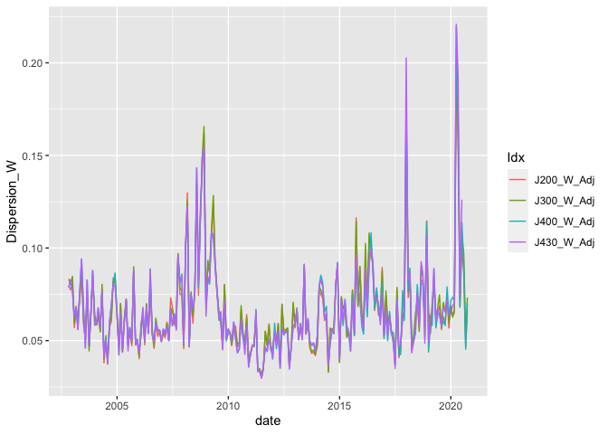
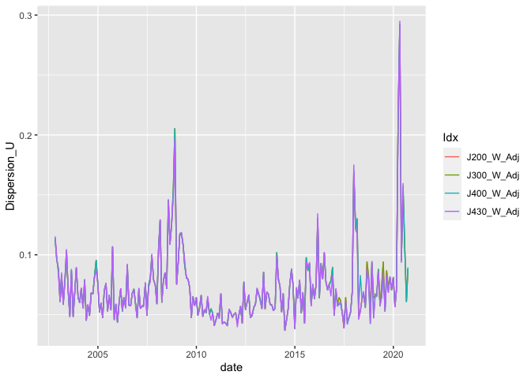
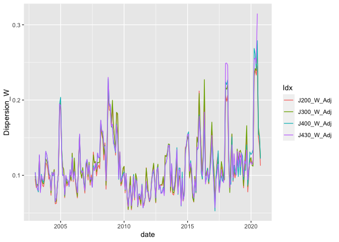
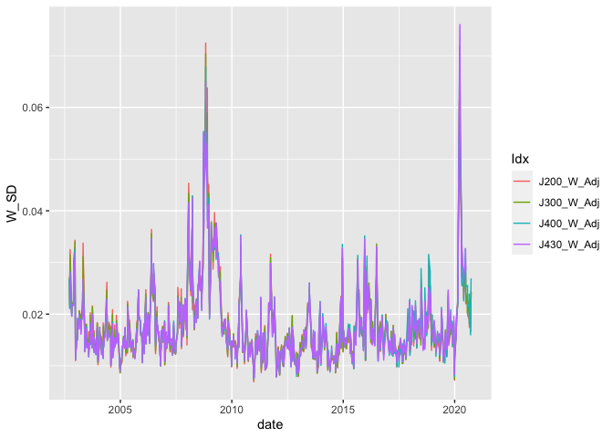
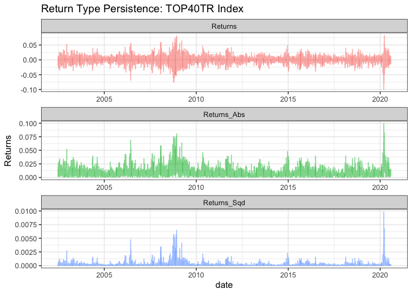

README
================

## Dispersion study

In the data folder, I give you the intra-day dispersion numbers for the
J200 (ALSI Top 40) and J400 (Swix top 40).

Also included is the weekly and 1 and 3 monthly calculated dispersion,
avg stock correlation and avg SD calcs for J200, J400, J300 and J430.
This is a treasure trove of data.

``` r
library(tidyverse)
```

    ## ── Attaching packages ─────────────────────────────────────── tidyverse 1.3.0 ──

    ## ✓ ggplot2 3.3.2     ✓ purrr   0.3.4
    ## ✓ tibble  3.0.4     ✓ dplyr   1.0.2
    ## ✓ tidyr   1.1.2     ✓ stringr 1.4.0
    ## ✓ readr   1.3.1     ✓ forcats 0.4.0

    ## ── Conflicts ────────────────────────────────────────── tidyverse_conflicts() ──
    ## x dplyr::filter() masks stats::filter()
    ## x dplyr::lag()    masks stats::lag()

``` r
# Intraday dispersion last 4 years:
ID_Disp <- read_rds("data/ID_Disp.rds") %>% filter(date >= as.Date("2016-07-29") & date <= as.Date("2020-07-31"))

ID_Disp %>% 
  ggplot() + 
  geom_line(aes(date, ID_Dispersion_W_J400)) + 
  geom_line(aes(date, ID_Dispersion_W_J200), color = "red")
```

<!-- -->

``` r
# Intraday weighted average realized volatility:
Ivol <- bind_rows(read_rds("data/J200_IVol.rds") %>% select(date, Avg_RV, W_Avg_RV = W_Avg_RV_J200) %>% mutate(Idx = "J200") %>% gather(Type, Value, -date, -Idx), 
                  read_rds("data/J400_IVol.rds") %>% select(date, Avg_RV, W_Avg_RV = W_Avg_RV_J400) %>% mutate(Idx = "J400") %>% gather(Type, Value, -date, -Idx))

Ivol %>% filter(Type == "W_Avg_RV") %>% 
  ggplot() + 
  geom_line(aes(date, Value, color = Idx)) + 
  labs(title = "Weighted Avg Realized Volatility") + theme_bw()
```

<!-- -->

``` r
# Dispersion - lower frequency
W_Dispersion <- 
  read_rds("data/Dispersion/Weekly.rds")
M_Dispersion <- 
  read_rds("data/Dispersion/Monthly.rds")

# Correlations will be similar (as constituents are quite similar)
M_Dispersion %>% filter(Freq == "1_Month") %>% 
  ggplot() + geom_line(aes(date, Avg_Corr, color = Idx))
```

<!-- -->

``` r
M_Dispersion %>% filter(Freq == "1_Month") %>% 
  ggplot() + geom_line(aes(date, Dispersion_W, color = Idx))
```

<!-- -->

``` r
M_Dispersion %>% filter(Freq == "1_Month") %>% 
  ggplot() + geom_line(aes(date, Dispersion_U, color = Idx))
```

<!-- -->

``` r
M_Dispersion %>% filter(Freq == "3_Month") %>% 
  ggplot() + geom_line(aes(date, Dispersion_W, color = Idx))
```

<!-- -->

``` r
W_Dispersion %>% 
  ggplot() + geom_line(aes(date, W_SD, color = Idx))
```

<!-- -->

## Importing index returns data

``` r
library(tbl2xts)

# the JSE top 40 index used to create a simple return index

TP40 <- fmxdat::SA_Indexes %>% filter(Tickers == "TOP40TR Index") %>% 
    mutate(SimpleRet = Price / lag(Price)-1) %>% 
    ungroup() %>% select(date, SimpleRet) %>% tbl2xts::tbl_xts()

Plotdata <- cbind(TP40, TP40^2, abs(TP40))
colnames(Plotdata) <- c("Returns", "Returns_Sqd", "Returns_Abs")

Plotdata <- Plotdata %>% xts_tbl() %>% gather(ReturnType, Returns, 
    -date)

ggplot(Plotdata) + geom_line(aes(x = date, y = Returns, colour = ReturnType, 
    alpha = 0.5)) + ggtitle("Return Type Persistence: TOP40TR Index") + 
    facet_wrap(~ReturnType, nrow = 3, ncol = 1, scales = "free") + 
    guides(alpha = FALSE, colour = FALSE) + theme_bw()
```

    ## Warning: Removed 3 row(s) containing missing values (geom_path).

<!-- -->

# Estimating the GARCH

``` r
library(rugarch)
```

    ## Loading required package: parallel

    ## 
    ## Attaching package: 'rugarch'

    ## The following object is masked from 'package:purrr':
    ## 
    ##     reduce

    ## The following object is masked from 'package:stats':
    ## 
    ##     sigma

``` r
# combining the two datasets to make sure that they line up 

comb <- ID_Disp %>% select(date, ID_Dispersion_W_J400) %>%  left_join(xts_tbl(TP40), by="date") %>%
  tbl_xts() 

comb[is.na(comb)] <- 0 

colSums(is.na(comb))
```

    ## ID_Dispersion_W_J400            SimpleRet 
    ##                    0                    0

``` r
fit <- comb[,2]

# first fit the simple model to returns 

garch1 <- ugarchspec(variance.model = list(model = c("sGARCH", 
    "gjrGARCH", "eGARCH", "fGARCH", "apARCH")[1], garchOrder = c(1, 
    1), external.regressors = NULL), mean.model = list(armaOrder = c(1, 0), include.mean = TRUE), 
    distribution.model = c("norm", "snorm", "std", "sstd", "ged","sged", "nig", "ghyp", "jsu")[1])

garchfit1 = ugarchfit(spec = garch1, data = fit)

garchfit1
```

    ## 
    ## *---------------------------------*
    ## *          GARCH Model Fit        *
    ## *---------------------------------*
    ## 
    ## Conditional Variance Dynamics    
    ## -----------------------------------
    ## GARCH Model  : sGARCH(1,1)
    ## Mean Model   : ARFIMA(1,0,0)
    ## Distribution : norm 
    ## 
    ## Optimal Parameters
    ## ------------------------------------
    ##         Estimate  Std. Error  t value Pr(>|t|)
    ## mu      0.000586    0.000286  2.04811  0.04055
    ## ar1    -0.021374    0.034106 -0.62668  0.53087
    ## omega   0.000003    0.000002  1.38362  0.16648
    ## alpha1  0.101767    0.019006  5.35452  0.00000
    ## beta1   0.874803    0.022178 39.44383  0.00000
    ## 
    ## Robust Standard Errors:
    ##         Estimate  Std. Error  t value Pr(>|t|)
    ## mu      0.000586    0.000281  2.08339 0.037215
    ## ar1    -0.021374    0.033717 -0.63391 0.526138
    ## omega   0.000003    0.000008  0.37439 0.708113
    ## alpha1  0.101767    0.033155  3.06940 0.002145
    ## beta1   0.874803    0.056884 15.37865 0.000000
    ## 
    ## LogLikelihood : 3161.353 
    ## 
    ## Information Criteria
    ## ------------------------------------
    ##                     
    ## Akaike       -6.3190
    ## Bayes        -6.2945
    ## Shibata      -6.3191
    ## Hannan-Quinn -6.3097
    ## 
    ## Weighted Ljung-Box Test on Standardized Residuals
    ## ------------------------------------
    ##                         statistic p-value
    ## Lag[1]                     0.1690  0.6810
    ## Lag[2*(p+q)+(p+q)-1][2]    0.1797  0.9992
    ## Lag[4*(p+q)+(p+q)-1][5]    2.8086  0.4810
    ## d.o.f=1
    ## H0 : No serial correlation
    ## 
    ## Weighted Ljung-Box Test on Standardized Squared Residuals
    ## ------------------------------------
    ##                         statistic p-value
    ## Lag[1]                      1.034 0.30918
    ## Lag[2*(p+q)+(p+q)-1][5]     6.845 0.05653
    ## Lag[4*(p+q)+(p+q)-1][9]    10.842 0.03294
    ## d.o.f=2
    ## 
    ## Weighted ARCH LM Tests
    ## ------------------------------------
    ##             Statistic Shape Scale  P-Value
    ## ARCH Lag[3]     1.832 0.500 2.000 0.175833
    ## ARCH Lag[5]    10.888 1.440 1.667 0.003986
    ## ARCH Lag[7]    11.957 2.315 1.543 0.006355
    ## 
    ## Nyblom stability test
    ## ------------------------------------
    ## Joint Statistic:  8.1748
    ## Individual Statistics:              
    ## mu     0.04486
    ## ar1    0.05302
    ## omega  1.71482
    ## alpha1 0.29833
    ## beta1  0.24180
    ## 
    ## Asymptotic Critical Values (10% 5% 1%)
    ## Joint Statistic:          1.28 1.47 1.88
    ## Individual Statistic:     0.35 0.47 0.75
    ## 
    ## Sign Bias Test
    ## ------------------------------------
    ##                    t-value   prob sig
    ## Sign Bias          0.69674 0.4861    
    ## Negative Sign Bias 0.01763 0.9859    
    ## Positive Sign Bias 1.37531 0.1693    
    ## Joint Effect       5.45206 0.1415    
    ## 
    ## 
    ## Adjusted Pearson Goodness-of-Fit Test:
    ## ------------------------------------
    ##   group statistic p-value(g-1)
    ## 1    20     19.16       0.4467
    ## 2    30     34.36       0.2262
    ## 3    40     42.64       0.3173
    ## 4    50     43.49       0.6952
    ## 
    ## 
    ## Elapsed time : 0.2213342

``` r
# identifying the fit and external regressor for the model then fitting it to GARCH-X

exreg <- comb[,1]

garchx <- ugarchspec(variance.model = list(model = c("sGARCH", 
    "gjrGARCH", "eGARCH", "fGARCH", "apARCH")[1], garchOrder = c(1, 
    1), external.regressors = exreg), mean.model = list(armaOrder = c(1, 0), include.mean = TRUE), 
    distribution.model = c("norm", "snorm", "std", "sstd", "ged","sged", "nig", "ghyp", "jsu")[1])

# Now to fit the garch to the returns

garchfitx = ugarchfit(spec = garchx, data = fit)

garchfitx
```

    ## 
    ## *---------------------------------*
    ## *          GARCH Model Fit        *
    ## *---------------------------------*
    ## 
    ## Conditional Variance Dynamics    
    ## -----------------------------------
    ## GARCH Model  : sGARCH(1,1)
    ## Mean Model   : ARFIMA(1,0,0)
    ## Distribution : norm 
    ## 
    ## Optimal Parameters
    ## ------------------------------------
    ##         Estimate  Std. Error  t value Pr(>|t|)
    ## mu     -0.000381    0.000355 -1.07457 0.282567
    ## ar1    -0.018045    0.035910 -0.50252 0.615302
    ## omega   0.000000    0.000003  0.00000 1.000000
    ## alpha1  0.119649    0.040245  2.97305 0.002949
    ## beta1   0.327516    0.132646  2.46911 0.013545
    ## vxreg1  0.002659    0.000750  3.54783 0.000388
    ## 
    ## Robust Standard Errors:
    ##         Estimate  Std. Error  t value Pr(>|t|)
    ## mu     -0.000381    0.001491 -0.25568  0.79820
    ## ar1    -0.018045    0.052175 -0.34586  0.72945
    ## omega   0.000000    0.000007  0.00000  1.00000
    ## alpha1  0.119649    0.227176  0.52668  0.59842
    ## beta1   0.327516    0.913558  0.35851  0.71996
    ## vxreg1  0.002659    0.005160  0.51537  0.60629
    ## 
    ## LogLikelihood : 3180.455 
    ## 
    ## Information Criteria
    ## ------------------------------------
    ##                     
    ## Akaike       -6.3553
    ## Bayes        -6.3258
    ## Shibata      -6.3553
    ## Hannan-Quinn -6.3441
    ## 
    ## Weighted Ljung-Box Test on Standardized Residuals
    ## ------------------------------------
    ##                         statistic p-value
    ## Lag[1]                     0.1976  0.6567
    ## Lag[2*(p+q)+(p+q)-1][2]    0.2091  0.9986
    ## Lag[4*(p+q)+(p+q)-1][5]    4.2838  0.1838
    ## d.o.f=1
    ## H0 : No serial correlation
    ## 
    ## Weighted Ljung-Box Test on Standardized Squared Residuals
    ## ------------------------------------
    ##                         statistic   p-value
    ## Lag[1]                       1.47 2.253e-01
    ## Lag[2*(p+q)+(p+q)-1][5]     30.73 1.971e-08
    ## Lag[4*(p+q)+(p+q)-1][9]     48.84 2.220e-12
    ## d.o.f=2
    ## 
    ## Weighted ARCH LM Tests
    ## ------------------------------------
    ##             Statistic Shape Scale   P-Value
    ## ARCH Lag[3]     23.33 0.500 2.000 1.365e-06
    ## ARCH Lag[5]     40.85 1.440 1.667 1.062e-10
    ## ARCH Lag[7]     47.74 2.315 1.543 2.941e-12
    ## 
    ## Nyblom stability test
    ## ------------------------------------
    ## Joint Statistic:  47.6351
    ## Individual Statistics:               
    ## mu      0.08197
    ## ar1     0.04436
    ## omega  11.03431
    ## alpha1  1.10188
    ## beta1   1.08068
    ## vxreg1  1.29789
    ## 
    ## Asymptotic Critical Values (10% 5% 1%)
    ## Joint Statistic:          1.49 1.68 2.12
    ## Individual Statistic:     0.35 0.47 0.75
    ## 
    ## Sign Bias Test
    ## ------------------------------------
    ##                    t-value    prob sig
    ## Sign Bias          1.85456 0.06396   *
    ## Negative Sign Bias 0.04475 0.96432    
    ## Positive Sign Bias 0.09030 0.92806    
    ## Joint Effect       6.20856 0.10189    
    ## 
    ## 
    ## Adjusted Pearson Goodness-of-Fit Test:
    ## ------------------------------------
    ##   group statistic p-value(g-1)
    ## 1    20     31.05      0.03987
    ## 2    30     40.43      0.07716
    ## 3    40     51.53      0.08629
    ## 4    50     60.31      0.12904
    ## 
    ## 
    ## Elapsed time : 0.367398

# Created:

``` r
# library(RA)
# load_core()
# Root <- setroot()
# EQSScreen <- "Tickers"
# UniverseSelect <- "JALSHAll"
# currency <- c("Local", "USD")[1]
# Price_Field = c("TOT_RETURN_INDEX_GROSS_DVDS", "PX_LAST")[1]
# 
# NonTradeDays <- RA::NonTradeDays(Root)
# IntraDays <-
#   datload(Root, "FullIDay", Intraday_Data) %>%
#   filter(!date %in% NonTradeDays) %>% mutate(Tickers = gsub(" SJ Equity", "", Tickers))
# 
# wts <-
#   datload(Root, SaveName = "EQS_Return_Daily", Db_Factors_Merge, UQ(EQSScreen), UQ(UniverseSelect), UQ(currency), UQ(Price_Field), EQS_Return_Daily)
# 
# ID_Disp <- IntraDays %>% select(date, contains("_Dispersion"), contains("_PXMove") ) %>% unique
# 
# IVol_J200 <-
#   left_join(IntraDays,
#             wts %>% mutate(Tickers = gsub(" SJ Equity", "", Tickers)) %>% select(date, Tickers, wt = J200_W_Adj) %>% filter(!is.na(wt)),
#             by = c("date", "Tickers")) %>%
#   select(date, Tickers, RV, J200 = wt) %>% filter(!is.na(J200)) %>%
#   group_by(date) %>% mutate(J200 = J200 / sum(J200)) %>% summarise(Avg_RV = mean(RV), W_Avg_RV_J200 = sum(J200 * RV) ) %>% ungroup() %>% unique
# 
# datstore(Root, SaveName = "J200_IVol", dataframe = IVol_J200,
#          Research, FMX_Projects_2020, Charles, data)
# 
# IVol_J400 <-
#   left_join(IntraDays,
#             wts %>% mutate(Tickers = gsub(" SJ Equity", "", Tickers)) %>% select(date, Tickers, wt = J400_W_Adj) %>% filter(!is.na(wt)),
#             by = c("date", "Tickers")) %>%
#   select(date, Tickers, RV, J400 = wt) %>% filter(!is.na(J400)) %>%
#     group_by(date) %>% mutate(J400 = J400 / sum(J400)) %>% summarise(Avg_RV = mean(RV), W_Avg_RV_J400 = sum(J400 * RV)) %>% ungroup() %>% unique
# 
# datstore(Root, SaveName = "J400_IVol", dataframe = IVol_J400,
#          Research, FMX_Projects_2020, Charles, data)
# 
# datstore(Root, SaveName = "ID_Disp", dataframe = ID_Disp,
#          Research, FMX_Projects_2020, Charles, data)
# 
# bind_rows(
#   "D:/Work/RAnalytics/Data/Dispersion/Monthly/1" %>% list.files(., full.names = T, recursive = T) %>%
#   as.list() %>% map_df(~read_rds(.)) %>% select(date, Dispersion_U, Dispersion_W, Avg_Corr, W_SD, Avg_SD, Idx) %>% unique %>% mutate(Freq = "1_Month"),
#   "D:/Work/RAnalytics/Data/Dispersion/Monthly/3" %>% list.files(., full.names = T, recursive = T) %>%
#   as.list() %>% map_df(~read_rds(.)) %>% select(date, Dispersion_U, Dispersion_W, Avg_Corr, W_SD, Idx) %>% unique %>% mutate(Freq = "3_Month")
# ) %>%
#   write_rds("data/Dispersion/Monthly.rds")
# 
#  "D:/Work/RAnalytics/Data/Dispersion/Weekly/1" %>% list.files(., full.names = T, recursive = T) %>%
#  map_df(~read_rds(.)) %>% select(date, Dispersion_U, Dispersion_W, Avg_Corr, W_SD, Idx) %>% unique %>% mutate(Freq = "Weekly") %>% 
#  write_rds("data/Dispersion/Weekly.rds")
```
