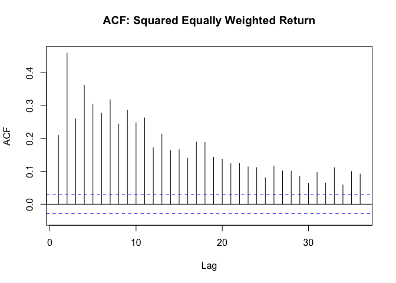
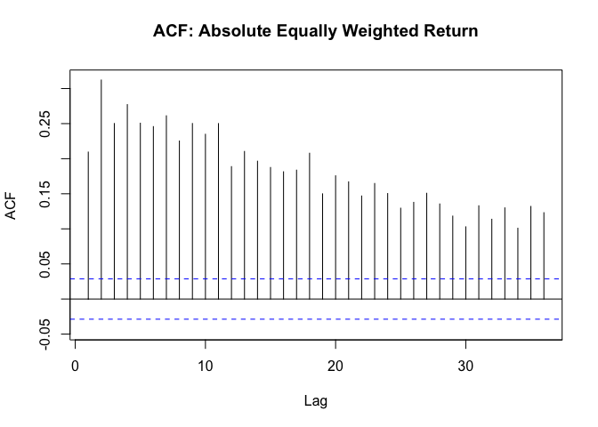
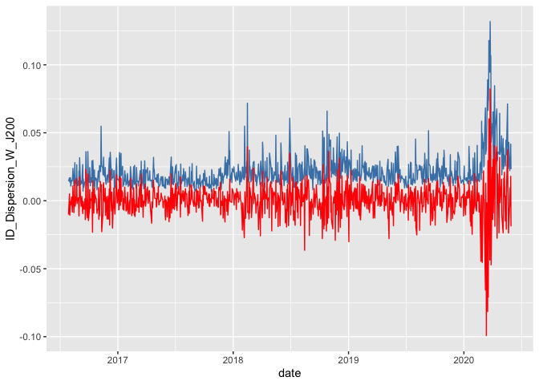
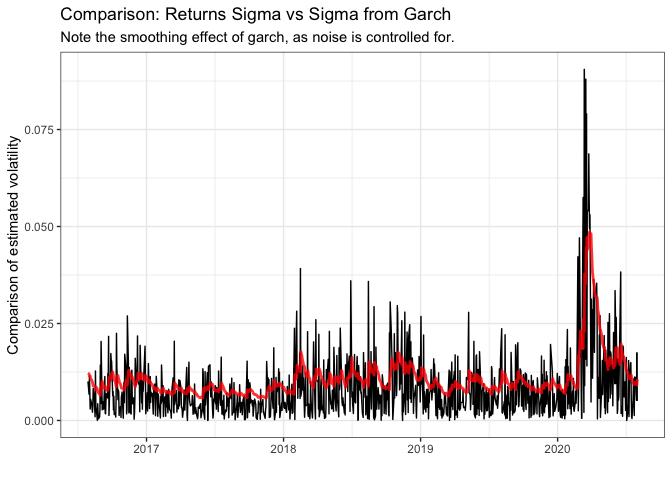
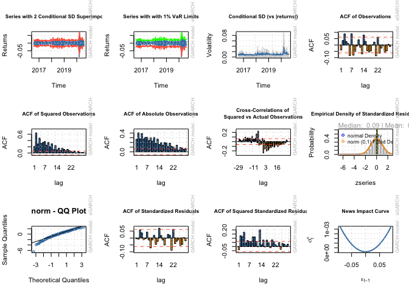
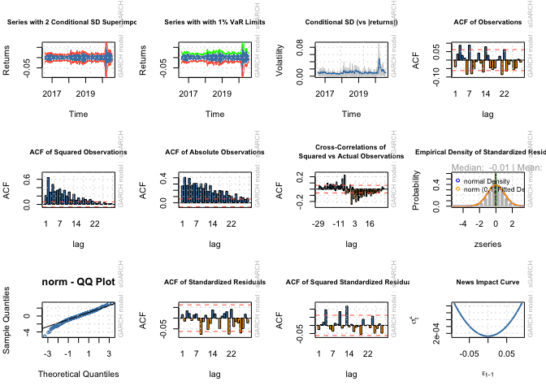
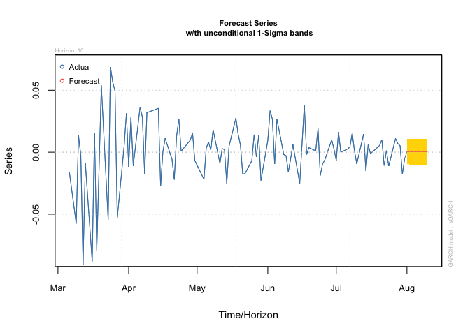
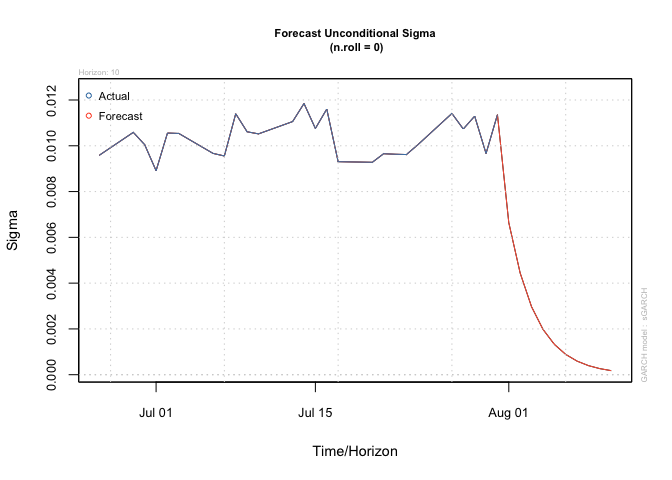
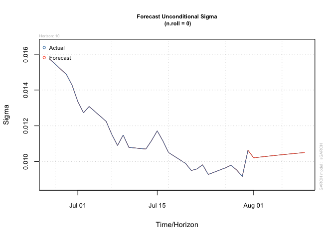

README
================

## Dispersion study

In the data folder, I give you the intra-day dispersion numbers for the
J200 (ALSI Top 40) and J400 (Swix top 40).

Also included is the weekly and 1 and 3 monthly calculated dispersion,
avg stock correlation and avg SD calcs for J200, J400, J300 and J430.
This is a treasure trove of data.

``` r
# Intraday dispersion last 4 years:
ID_Disp <- read_rds("data/ID_Disp.rds") %>% filter(date >= as.Date("2016-07-29") & date <= as.Date("2020-07-31"))

ID_dispw <- ID_Disp %>% select(date, ID_Dispersion_W_J400) %>% tbl_xts() %>% apply.weekly(mean)

ID_Disp %>% 
  ggplot() + 
  geom_line(aes(date, ID_Dispersion_W_J400)) + 
  geom_line(aes(date, ID_Dispersion_W_J200), color = "red")
```

<!-- -->

``` r
# Intraday weighted average realized volatility:
Ivol <- bind_rows(read_rds("data/J200_IVol.rds") %>% select(date, Avg_RV, W_Avg_RV = W_Avg_RV_J200) %>% mutate(Idx = "J200") %>% gather(Type, Value, -date, -Idx), 
                  read_rds("data/J400_IVol.rds") %>% select(date, Avg_RV, W_Avg_RV = W_Avg_RV_J400) %>% mutate(Idx = "J400") %>% gather(Type, Value, -date, -Idx))

Ivol %>% filter(Type == "W_Avg_RV") %>% 
  ggplot() + 
  geom_line(aes(date, Value, color = Idx)) + 
  labs(title = "Weighted Avg Realized Volatility") + theme_bw()
```

<!-- -->

``` r
# Dispersion - lower frequency
W_Dispersion <- 
  read_rds("data/Dispersion/Weekly.rds")
M_Dispersion <- 
  read_rds("data/Dispersion/Monthly.rds")
```

## Importing index returns data

The returns data used to construct the

``` r
library(tbl2xts)

# the JSE top 40 index used to create a simple return index

#TP40 <- fmxdat::SA_Indexes %>% filter(Tickers == "JSHRALTR Index") %>% 
#    mutate(SimpleRet = Price / lag(Price)-1) %>% 
#    ungroup() %>% select(date, SimpleRet) %>% tbl2xts::tbl_xts()

# locally storing the TP40 data

# saveRDS(TP40, file = "data/TP40.rds")

TP40 <- read_rds("data/TP40.rds")

# plotting the data 

Plotdata <- cbind(TP40, TP40^2, abs(TP40))
colnames(Plotdata) <- c("Returns", "Returns_Sqd", "Returns_Abs")

Plotdata <- Plotdata %>% xts_tbl() %>% gather(ReturnType, Returns,-date) %>%
  filter(date >= as.Date("2016-07-29") & date <= as.Date("2020-07-31"))

ggplot(Plotdata) + geom_line(aes(x = date, y = Returns, colour = ReturnType, 
    alpha = 0.5)) + ggtitle("Return Type Persistence: TOP40TR Index") + 
    facet_wrap(~ReturnType, nrow = 3, ncol = 1, scales = "free") + 
    guides(alpha = FALSE, colour = FALSE) + theme_bw()
```

<!-- -->

## tests

``` r
forecast::Acf(TP40, main = "ACF: Equally Weighted Return")
```

<!-- -->

``` r
forecast::Acf(TP40^2, main = "ACF: Squared Equally Weighted Return")
```

<!-- -->

``` r
forecast::Acf(abs(TP40), main = "ACF: Absolute Equally Weighted Return")
```

<!-- -->

These test prove that there is conditional heteroskedasticity in the
data - there is volatility is clustering.

``` r
Box.test(coredata(TP40^2), type = "Ljung-Box", lag = 12)
```

    ## 
    ##  Box-Ljung test
    ## 
    ## data:  coredata(TP40^2)
    ## X-squared = 4772.6, df = 12, p-value < 2.2e-16

# Estimating the GARCH

## Simple GARCH on returns

``` r
library(rugarch)

# combining the two datasets to make sure that they line up 

comb <- ID_Disp %>% select(date, ID_Dispersion_W_J400) %>%  left_join(xts_tbl(TP40), by="date") %>%
  tbl_xts() 

# plot dispersion against returns

comb %>% xts_tbl() %>% 
  ggplot() + 
  geom_line(aes(date, ID_Dispersion_W_J400), color = "steel blue") + 
  geom_line(aes(date, SimpleRet), color = "red")
```

<!-- -->

``` r
# remove the NAs - temporary solution 

comb[is.na(comb)] <- 0 

colSums(is.na(comb))
```

ID\_Dispersion\_W\_J400 SimpleRet 0 0

``` r
fit <- comb[,2]


# first fit the simple model to returns 

garch1 <- ugarchspec(variance.model = list(model = c("sGARCH", 
    "gjrGARCH", "eGARCH", "fGARCH", "apARCH")[1], garchOrder = c(1, 
    1), external.regressors = NULL), mean.model = list(armaOrder = c(1, 0), include.mean = TRUE), 
    distribution.model = c("norm", "snorm", "std", "sstd", "ged","sged", "nig", "ghyp", "jsu")[1])

garchfit1 = ugarchfit(spec = garch1, data = fit)

kable(garchfit1@fit$matcoef, format = "html")
```

<table>

<thead>

<tr>

<th style="text-align:left;">

</th>

<th style="text-align:right;">

Estimate

</th>

<th style="text-align:right;">

Std. Error

</th>

<th style="text-align:right;">

t value

</th>

<th style="text-align:right;">

Pr(\>|t|)

</th>

</tr>

</thead>

<tbody>

<tr>

<td style="text-align:left;">

mu

</td>

<td style="text-align:right;">

0.0004474

</td>

<td style="text-align:right;">

0.0002752

</td>

<td style="text-align:right;">

1.6256283

</td>

<td style="text-align:right;">

0.1040287

</td>

</tr>

<tr>

<td style="text-align:left;">

ar1

</td>

<td style="text-align:right;">

\-0.0171957

</td>

<td style="text-align:right;">

0.0343049

</td>

<td style="text-align:right;">

\-0.5012615

</td>

<td style="text-align:right;">

0.6161871

</td>

</tr>

<tr>

<td style="text-align:left;">

omega

</td>

<td style="text-align:right;">

0.0000034

</td>

<td style="text-align:right;">

0.0000027

</td>

<td style="text-align:right;">

1.2378715

</td>

<td style="text-align:right;">

0.2157637

</td>

</tr>

<tr>

<td style="text-align:left;">

alpha1

</td>

<td style="text-align:right;">

0.1174970

</td>

<td style="text-align:right;">

0.0215932

</td>

<td style="text-align:right;">

5.4414018

</td>

<td style="text-align:right;">

0.0000001

</td>

</tr>

<tr>

<td style="text-align:left;">

beta1

</td>

<td style="text-align:right;">

0.8571821

</td>

<td style="text-align:right;">

0.0274395

</td>

<td style="text-align:right;">

31.2390053

</td>

<td style="text-align:right;">

0.0000000

</td>

</tr>

</tbody>

</table>

``` r
kable(garchfit1@fit$robust.matcoef, format = "html")
```

<table>

<thead>

<tr>

<th style="text-align:left;">

</th>

<th style="text-align:right;">

Estimate

</th>

<th style="text-align:right;">

Std. Error

</th>

<th style="text-align:right;">

t value

</th>

<th style="text-align:right;">

Pr(\>|t|)

</th>

</tr>

</thead>

<tbody>

<tr>

<td style="text-align:left;">

mu

</td>

<td style="text-align:right;">

0.0004474

</td>

<td style="text-align:right;">

0.0002731

</td>

<td style="text-align:right;">

1.6382839

</td>

<td style="text-align:right;">

0.1013625

</td>

</tr>

<tr>

<td style="text-align:left;">

ar1

</td>

<td style="text-align:right;">

\-0.0171957

</td>

<td style="text-align:right;">

0.0330750

</td>

<td style="text-align:right;">

\-0.5199013

</td>

<td style="text-align:right;">

0.6031324

</td>

</tr>

<tr>

<td style="text-align:left;">

omega

</td>

<td style="text-align:right;">

0.0000034

</td>

<td style="text-align:right;">

0.0000111

</td>

<td style="text-align:right;">

0.3042190

</td>

<td style="text-align:right;">

0.7609611

</td>

</tr>

<tr>

<td style="text-align:left;">

alpha1

</td>

<td style="text-align:right;">

0.1174970

</td>

<td style="text-align:right;">

0.0348355

</td>

<td style="text-align:right;">

3.3729088

</td>

<td style="text-align:right;">

0.0007438

</td>

</tr>

<tr>

<td style="text-align:left;">

beta1

</td>

<td style="text-align:right;">

0.8571821

</td>

<td style="text-align:right;">

0.0811577

</td>

<td style="text-align:right;">

10.5619346

</td>

<td style="text-align:right;">

0.0000000

</td>

</tr>

</tbody>

</table>

## Fitting with external reg

``` r
# identifying the fit and external regressor for the model then fitting it to GARCH-X

exreg <- comb[,1]

garchx <- ugarchspec(variance.model = list(model = c("sGARCH", 
    "gjrGARCH", "eGARCH", "fGARCH", "apARCH")[1], garchOrder = c(1, 
    1), external.regressors = exreg), mean.model = list(armaOrder = c(1, 0), include.mean = TRUE), 
    distribution.model = c("norm", "snorm", "std", "sstd", "ged","sged", "nig", "ghyp", "jsu")[1])

# Now to fit the garch to the returns

garchfitx = ugarchfit(spec = garchx, data = fit)

kable(garchfitx@fit$matcoef, format = "html")
```

<table>

<thead>

<tr>

<th style="text-align:left;">

</th>

<th style="text-align:right;">

Estimate

</th>

<th style="text-align:right;">

Std. Error

</th>

<th style="text-align:right;">

t value

</th>

<th style="text-align:right;">

Pr(\>|t|)

</th>

</tr>

</thead>

<tbody>

<tr>

<td style="text-align:left;">

mu

</td>

<td style="text-align:right;">

\-0.0005277

</td>

<td style="text-align:right;">

0.0003137

</td>

<td style="text-align:right;">

\-1.6822670

</td>

<td style="text-align:right;">

0.0925171

</td>

</tr>

<tr>

<td style="text-align:left;">

ar1

</td>

<td style="text-align:right;">

\-0.0197627

</td>

<td style="text-align:right;">

0.0354290

</td>

<td style="text-align:right;">

\-0.5578117

</td>

<td style="text-align:right;">

0.5769730

</td>

</tr>

<tr>

<td style="text-align:left;">

omega

</td>

<td style="text-align:right;">

0.0000000

</td>

<td style="text-align:right;">

0.0000027

</td>

<td style="text-align:right;">

0.0000000

</td>

<td style="text-align:right;">

1.0000000

</td>

</tr>

<tr>

<td style="text-align:left;">

alpha1

</td>

<td style="text-align:right;">

0.1293955

</td>

<td style="text-align:right;">

0.0357061

</td>

<td style="text-align:right;">

3.6239067

</td>

<td style="text-align:right;">

0.0002902

</td>

</tr>

<tr>

<td style="text-align:left;">

beta1

</td>

<td style="text-align:right;">

0.3178723

</td>

<td style="text-align:right;">

0.0974126

</td>

<td style="text-align:right;">

3.2631541

</td>

<td style="text-align:right;">

0.0011018

</td>

</tr>

<tr>

<td style="text-align:left;">

vxreg1

</td>

<td style="text-align:right;">

0.0024830

</td>

<td style="text-align:right;">

0.0005079

</td>

<td style="text-align:right;">

4.8885846

</td>

<td style="text-align:right;">

0.0000010

</td>

</tr>

</tbody>

</table>

``` r
kable(garchfitx@fit$robust.matcoef, format = "html")
```

<table>

<thead>

<tr>

<th style="text-align:left;">

</th>

<th style="text-align:right;">

Estimate

</th>

<th style="text-align:right;">

Std. Error

</th>

<th style="text-align:right;">

t value

</th>

<th style="text-align:right;">

Pr(\>|t|)

</th>

</tr>

</thead>

<tbody>

<tr>

<td style="text-align:left;">

mu

</td>

<td style="text-align:right;">

\-0.0005277

</td>

<td style="text-align:right;">

0.0007748

</td>

<td style="text-align:right;">

\-0.6810565

</td>

<td style="text-align:right;">

0.4958357

</td>

</tr>

<tr>

<td style="text-align:left;">

ar1

</td>

<td style="text-align:right;">

\-0.0197627

</td>

<td style="text-align:right;">

0.0342408

</td>

<td style="text-align:right;">

\-0.5771686

</td>

<td style="text-align:right;">

0.5638256

</td>

</tr>

<tr>

<td style="text-align:left;">

omega

</td>

<td style="text-align:right;">

0.0000000

</td>

<td style="text-align:right;">

0.0000039

</td>

<td style="text-align:right;">

0.0000000

</td>

<td style="text-align:right;">

1.0000000

</td>

</tr>

<tr>

<td style="text-align:left;">

alpha1

</td>

<td style="text-align:right;">

0.1293955

</td>

<td style="text-align:right;">

0.1300185

</td>

<td style="text-align:right;">

0.9952082

</td>

<td style="text-align:right;">

0.3196350

</td>

</tr>

<tr>

<td style="text-align:left;">

beta1

</td>

<td style="text-align:right;">

0.3178723

</td>

<td style="text-align:right;">

0.4633221

</td>

<td style="text-align:right;">

0.6860720

</td>

<td style="text-align:right;">

0.4926677

</td>

</tr>

<tr>

<td style="text-align:left;">

vxreg1

</td>

<td style="text-align:right;">

0.0024830

</td>

<td style="text-align:right;">

0.0024024

</td>

<td style="text-align:right;">

1.0335708

</td>

<td style="text-align:right;">

0.3013368

</td>

</tr>

</tbody>

</table>

``` r
# forecast

garchxfor <- ugarchforecast(garchfitx, data = NULL, n.ahead = 10, n.roll
                        = 0, out.sample = 100, external.forecasts = list(mregfor=NULL, vregfor=exreg))

garchfor <- ugarchforecast(garchfit1, n.ahead = 10)


# forecast sigmas:
f1 <-as.data.frame(sigma(garchfor))

f2 <-as.data.frame(sigma(garchxfor))

series1 <- fitted(garchfor)

series2 <- fitted(garchxfor)

sigmaf <- cbind(f1, f2)

fitf <-cbind(series1, series2)

vol <- sigmaf^2

colnames(vol) <- c("GARCH", "GARCH-X")

kable(vol)
```

|      |     GARCH |  GARCH-X |
| :--- | --------: | -------: |
| T+1  | 0.0001043 | 8.13e-05 |
| T+2  | 0.0001050 | 8.21e-05 |
| T+3  | 0.0001058 | 7.16e-05 |
| T+4  | 0.0001065 | 8.07e-05 |
| T+5  | 0.0001072 | 6.69e-05 |
| T+6  | 0.0001078 | 7.27e-05 |
| T+7  | 0.0001085 | 7.04e-05 |
| T+8  | 0.0001091 | 8.33e-05 |
| T+9  | 0.0001098 | 9.72e-05 |
| T+10 | 0.0001104 | 6.99e-05 |

## compare forecasts

## Veiw the two conditional variance plots

``` r
# First for the garch-x
sigmax <- sigma(garchfitx) %>% xts_tbl()
colnames(sigmax) <- c("date", "sigma")
sigmax <- sigmax %>% mutate(date = as.Date(date))


ggplot() + geom_line(data = Plotdata %>% filter(ReturnType == 
    "Returns_Sqd") %>% select(date, Returns) %>% unique %>% mutate(Returns = sqrt(Returns)), 
    aes(x = date, y = Returns)) + geom_line(data = sigmax, aes(x = date, 
    y = sigma), color = "red", size = 1, alpha = 0.8) + theme_bw() + 
    # scale_y_continuous(limits = c(0, 0.35)) +
labs(title = "Comparison: Returns Sigma vs Sigma from Garch-x", 
    subtitle = "Note the smoothing effect of garch, as noise is controlled for.", 
    x = "", y = "Comparison of estimated volatility")
```

<!-- -->

``` r
# now for the garch

sigma <- sigma(garchfit1) %>% xts_tbl()
colnames(sigma) <- c("date", "sigma")
sigma <- sigma %>% mutate(date = as.Date(date))

ggplot() + geom_line(data = Plotdata %>% filter(ReturnType == 
    "Returns_Sqd") %>% select(date, Returns) %>% unique %>% mutate(Returns = sqrt(Returns)), 
    aes(x = date, y = Returns)) + geom_line(data = sigma, aes(x = date, 
    y = sigma), color = "red", size = 1, alpha = 0.8) + theme_bw() + 
    # scale_y_continuous(limits = c(0, 0.35)) +
labs(title = "Comparison: Returns Sigma vs Sigma from Garch", 
    subtitle = "Note the smoothing effect of garch, as noise is controlled for.", 
    x = "", y = "Comparison of estimated volatility")
```

<!-- -->

``` r
plot(garchfitx, which = 'all')
```

    ## 
    ## please wait...calculating quantiles...

<!-- -->

``` r
plot(garchfit1, which = 'all')
```

    ## 
    ## please wait...calculating quantiles...

<!-- -->

``` r
# testing the fit 

fit.ic <- cbind(infocriteria(garchfit1),infocriteria(garchfitx)) 

colnames(fit.ic) <-c("GARCH","GARCH-X")

kable(fit.ic)
```

|              |      GARCH |    GARCH-X |
| :----------- | ---------: | ---------: |
| Akaike       | \-6.373251 | \-6.421037 |
| Bayes        | \-6.348693 | \-6.391567 |
| Shibata      | \-6.373301 | \-6.421109 |
| Hannan-Quinn | \-6.363917 | \-6.409836 |

## forecast vol with the two models

``` r
garchfx <- ugarchforecast(garchfitx, n.ahead = 10)
garchf <- ugarchforecast(garchfit1, n.ahead = 10)

plot(garchfx, which = 1)
```

<!-- -->

``` r
plot(garchf, which = 1)
```

<!-- -->

``` r
plot(garchfx, which = 3)
```

<!-- -->

``` r
plot(garchf, which = 3)
```

<!-- -->

``` r
# rolling forecast

cl <- makePSOCKcluster(10)
# Thus the model spec is a ARIMA(1,1,0)-GJRGARCH(1,1), with
# normal distribution

roll <- ugarchroll(garch1, fit, forecast.length = 500, refit.every = 50, 
    refit.window = "moving", window.size = 1000, calculate.VaR = TRUE, 
    VaR.alpha = c(0.01, 0.05), keep.coef = TRUE, cluster = cl)

# For this, only 1-step ahead can be done automatically.
show(roll)
```

    ## 
    ## *-------------------------------------*
    ## *              GARCH Roll             *
    ## *-------------------------------------*
    ## No.Refits        : 10
    ## Refit Horizon    : 50
    ## No.Forecasts : 500
    ## GARCH Model      : sGARCH(1,1)
    ## Distribution : norm 
    ## 
    ## Forecast Density:
    ##               Mu  Sigma Skew Shape Shape(GIG) Realized
    ## 2018-07-31 5e-04 0.0100    0     0          0   0.0014
    ## 2018-08-01 5e-04 0.0097    0     0          0   0.0008
    ## 2018-08-02 5e-04 0.0094    0     0          0  -0.0175
    ## 2018-08-03 4e-04 0.0101    0     0          0   0.0118
    ## 2018-08-06 6e-04 0.0102    0     0          0  -0.0060
    ## 2018-08-07 5e-04 0.0100    0     0          0   0.0149
    ## 
    ## ..........................
    ##               Mu  Sigma Skew Shape Shape(GIG) Realized
    ## 2020-07-24 4e-04 0.0093    0     0          0  -0.0112
    ## 2020-07-27 5e-04 0.0097    0     0          0   0.0111
    ## 2020-07-28 4e-04 0.0098    0     0          0   0.0070
    ## 2020-07-29 4e-04 0.0096    0     0          0   0.0052
    ## 2020-07-30 4e-04 0.0092    0     0          0  -0.0175
    ## 2020-07-31 5e-04 0.0107    0     0          0  -0.0050
    ## 
    ## Elapsed: 15.62256 secs

``` r
report(roll, type = "fpm")
```

    ## 
    ## GARCH Roll Mean Forecast Performance Measures
    ## ---------------------------------------------
    ## Model        : sGARCH
    ## No.Refits    : 10
    ## No.Forecasts: 500
    ## 
    ##         Stats
    ## MSE 0.0002235
    ## MAE 0.0098640
    ## DAC 0.5180000

``` r
# Thus the model spec is a ARIMA(1,1,0)-GJRGARCH(1,1), with
# normal distribution

rollx <- ugarchroll(garchx, fit, forecast.length = 500, refit.every = 50, 
    refit.window = "moving", window.size = 1000, calculate.VaR = TRUE, 
    VaR.alpha = c(0.01, 0.05), keep.coef = TRUE, cluster = cl)

# For this, only 1-step ahead can be done automatically.
show(rollx)
```

    ## 
    ## *-------------------------------------*
    ## *              GARCH Roll             *
    ## *-------------------------------------*
    ## No.Refits        : 10
    ## Refit Horizon    : 50
    ## No.Forecasts : 500
    ## GARCH Model      : sGARCH(1,1)
    ## Distribution : norm 
    ## 
    ## Forecast Density:
    ##                Mu  Sigma Skew Shape Shape(GIG) Realized
    ## 2018-07-31 -6e-04 0.0094    0     0          0   0.0014
    ## 2018-08-01 -6e-04 0.0076    0     0          0   0.0008
    ## 2018-08-02 -6e-04 0.0078    0     0          0  -0.0175
    ## 2018-08-03 -9e-04 0.0094    0     0          0   0.0118
    ## 2018-08-06 -4e-04 0.0075    0     0          0  -0.0060
    ## 2018-08-07 -7e-04 0.0096    0     0          0   0.0149
    ## 
    ## ..........................
    ##                Mu  Sigma Skew Shape Shape(GIG) Realized
    ## 2020-07-24 -5e-04 0.0099    0     0          0  -0.0112
    ## 2020-07-27 -5e-04 0.0113    0     0          0   0.0111
    ## 2020-07-28 -6e-04 0.0108    0     0          0   0.0070
    ## 2020-07-29 -6e-04 0.0112    0     0          0   0.0052
    ## 2020-07-30 -6e-04 0.0096    0     0          0  -0.0175
    ## 2020-07-31 -4e-04 0.0114    0     0          0  -0.0050
    ## 
    ## Elapsed: 2.585242 secs

``` r
report(rollx, type = "fpm")
```

    ## 
    ## GARCH Roll Mean Forecast Performance Measures
    ## ---------------------------------------------
    ## Model        : sGARCH
    ## No.Refits    : 10
    ## No.Forecasts: 500
    ## 
    ##         Stats
    ## MSE 0.0002233
    ## MAE 0.0099000
    ## DAC 0.4820000

``` r
report(roll, type = "fpm")
```

    ## 
    ## GARCH Roll Mean Forecast Performance Measures
    ## ---------------------------------------------
    ## Model        : sGARCH
    ## No.Refits    : 10
    ## No.Forecasts: 500
    ## 
    ##         Stats
    ## MSE 0.0002235
    ## MAE 0.0098640
    ## DAC 0.5180000

## Run an AR(1) on

``` r
arima(TP40, order = c(1, 0, 1))
```

    ## 
    ## Call:
    ## arima(x = TP40, order = c(1, 0, 1))
    ## 
    ## Coefficients:
    ##          ar1     ma1  intercept
    ##       0.0079  0.0088      6e-04
    ## s.e.  0.8269  0.8424      2e-04
    ## 
    ## sigma^2 estimated as 0.0001303:  log likelihood = 14179.28,  aic = -28350.56

``` r
arima(exreg, order = c(1, 0, 0))
```

    ## 
    ## Call:
    ## arima(x = exreg, order = c(1, 0, 0))
    ## 
    ## Coefficients:
    ##          ar1  intercept
    ##       0.5082     0.0231
    ## s.e.  0.0272     0.0007
    ## 
    ## sigma^2 estimated as 0.0001357:  log likelihood = 3030.5,  aic = -6054.99

## Truncate the sample in daily data

``` r
RvolJ400 <- Ivol %>% filter(Idx == "J400", Type == "W_Avg_RV") %>% tbl_df() %>% 
  mutate(Qlow = quantile(Value, 0.15), Qhigh = quantile(Value, 0.85)) %>% 
  mutate(HighVol = ifelse(Value > Qhigh, "High", ifelse(Value < Qlow, "Low", "Neutral")))
```

    ## Warning: `tbl_df()` is deprecated as of dplyr 1.0.0.
    ## Please use `tibble::as_tibble()` instead.
    ## This warning is displayed once every 8 hours.
    ## Call `lifecycle::last_warnings()` to see where this warning was generated.

``` r
# make nas zero, temp solution

ID_dispJ400 <- ID_Disp %>% select(date, ID_Dispersion_W_J400) %>% na.omit() %>% 
  mutate(Qlow = quantile(ID_Dispersion_W_J400, 0.15), Qhigh = quantile(ID_Dispersion_W_J400, 0.85)) %>% 
  mutate(HighVol = ifelse(ID_Dispersion_W_J400 > Qhigh, "High", ifelse(ID_Dispersion_W_J400 < Qlow, "Low", "Neutral")))

# confusion matrix/contingency table

ID_dispJ400 %>% select(date, HighVol) %>% rename(Intraday_vol = HighVol) %>% 
  left_join(RvolJ400, by = "date") %>% rename(RealV_vol = HighVol) %>% select(Intraday_vol, RealV_vol) %>% 
  mutate(Intraday_vol = factor(Intraday_vol, levels = c("High","Neutral", "Low")), 
         RealV_vol = factor(RealV_vol, levels = c("High","Neutral", "Low"))) %>% table() %>% kable()
```

|         | High | Neutral | Low |
| :------ | ---: | ------: | --: |
| High    |   81 |      68 |   0 |
| Neutral |   71 |     532 |  93 |
| Low     |    1 |      87 |  61 |

``` r
#install.packages("caret")
#library(caret)
```

## truncate the sample in weekly format

``` r
# Truncate the weekly sample

RvolJ400w <- Ivol %>% filter(Idx == "J400", Type == "W_Avg_RV") %>% tbl_xts() %>% apply.weekly(mean) %>% 
  xts_tbl() %>% mutate(Qlow = quantile(Value, 0.15), Qhigh = quantile(Value, 0.85)) %>% 
    mutate(HighVol = ifelse(Value > Qhigh, "High", ifelse(Value < Qlow, "Low", "Neutral"))) 

# remove the nas from the sample

ID_dispJ400w <- ID_Disp %>% select(date, ID_Dispersion_W_J400) %>% na.omit() %>% tbl_xts() %>% apply.weekly(mean) %>%
  xts_tbl() %>% mutate(Qlow = quantile(ID_Dispersion_W_J400, 0.15), Qhigh = quantile(ID_Dispersion_W_J400, 0.85)) %>% 
  mutate(HighVol = ifelse(ID_Dispersion_W_J400 > Qhigh, "High", ifelse(ID_Dispersion_W_J400 < Qlow, "Low", "Neutral")))

# confusion matrix of the different periods of volatility

ID_dispJ400w %>% select(date, HighVol) %>% rename(Intraday_vol = HighVol) %>% 
  left_join(RvolJ400w, by = "date") %>% rename(RealV_vol = HighVol) %>% select(Intraday_vol, RealV_vol) %>% 
  mutate(Intraday_vol = factor(Intraday_vol, levels = c("High","Neutral", "Low")), 
         RealV_vol = factor(RealV_vol, levels = c("High","Neutral", "Low"))) %>% table() %>% kable()
```

|         | High | Neutral | Low |
| :------ | ---: | ------: | --: |
| High    |   24 |       8 |   0 |
| Neutral |    8 |     124 |  14 |
| Low     |    1 |      12 |  19 |

## The mean of the different dispersion vol regimes

``` r
ID_dispJ400 %>% select(date, HighVol) %>% rename(Intraday_vol = HighVol) %>% 
  left_join(RvolJ400, by = "date") %>% mutate(Intraday_vol = factor(Intraday_vol, levels = c("High","Neutral", "Low")), 
         HighVol = factor(HighVol, levels = c("High","Neutral", "Low"))) %>% with(tapply(Value, Intraday_vol, mean))
```

    ##       High    Neutral        Low 
    ## 0.02580403 0.01774428 0.01468713

## Lets try and fit weekly data to garch

``` r
# The two series for the model

comb2 <- comb %>% xts_tbl() %>% select(date, SimpleRet) %>% tbl_xts() %>% apply.weekly(mean)

combmain <- ID_Disp %>% select(date, ID_Dispersion_W_J400) %>% tbl_xts() %>% apply.weekly(mean) %>% 
  xts_tbl() %>% left_join(xts_tbl(comb2), by = "date") %>% na.omit() %>% tbl_xts() 

# check na's
colSums(is.na(combmain))
```

    ## ID_Dispersion_W_J400            SimpleRet 
    ##                    0                    0

``` r
fitw <- combmain[,2]
exregw <- combmain[,1]

# model weekly vol with ext reg

garchweekly <- ugarchspec(variance.model = list(model = "sGARCH", garchOrder = c(1, 
    1), external.regressors = NULL), mean.model = list(armaOrder = c(1, 0), include.mean = TRUE), 
    distribution.model = "norm")

garchx2 <- ugarchspec(variance.model = list(model = "sGARCH", garchOrder = c(1, 
    1), external.regressors = exregw), mean.model = list(armaOrder = c(1, 0), include.mean = TRUE), 
    distribution.model = "norm")

garchfit2 <- ugarchfit(spec = garchweekly, data = fitw)

garchfitx2 <- ugarchfit(spec = garchx2, data = fitw)
```

## Weekly data normal

``` r
kable(garchfit2@fit$matcoef, format = "html")
```

<table>

<thead>

<tr>

<th style="text-align:left;">

</th>

<th style="text-align:right;">

Estimate

</th>

<th style="text-align:right;">

Std. Error

</th>

<th style="text-align:right;">

t value

</th>

<th style="text-align:right;">

Pr(\>|t|)

</th>

</tr>

</thead>

<tbody>

<tr>

<td style="text-align:left;">

mu

</td>

<td style="text-align:right;">

0.0003065

</td>

<td style="text-align:right;">

0.0002915

</td>

<td style="text-align:right;">

1.0516322

</td>

<td style="text-align:right;">

0.2929683

</td>

</tr>

<tr>

<td style="text-align:left;">

ar1

</td>

<td style="text-align:right;">

\-0.0313997

</td>

<td style="text-align:right;">

0.0802030

</td>

<td style="text-align:right;">

\-0.3915035

</td>

<td style="text-align:right;">

0.6954251

</td>

</tr>

<tr>

<td style="text-align:left;">

omega

</td>

<td style="text-align:right;">

0.0000039

</td>

<td style="text-align:right;">

0.0000006

</td>

<td style="text-align:right;">

6.3887405

</td>

<td style="text-align:right;">

0.0000000

</td>

</tr>

<tr>

<td style="text-align:left;">

alpha1

</td>

<td style="text-align:right;">

0.1972441

</td>

<td style="text-align:right;">

0.0453789

</td>

<td style="text-align:right;">

4.3466063

</td>

<td style="text-align:right;">

0.0000138

</td>

</tr>

<tr>

<td style="text-align:left;">

beta1

</td>

<td style="text-align:right;">

0.6572609

</td>

<td style="text-align:right;">

0.0501095

</td>

<td style="text-align:right;">

13.1164824

</td>

<td style="text-align:right;">

0.0000000

</td>

</tr>

</tbody>

</table>

``` r
kable(garchfit2@fit$robust.matcoef, format = "html")
```

<table>

<thead>

<tr>

<th style="text-align:left;">

</th>

<th style="text-align:right;">

Estimate

</th>

<th style="text-align:right;">

Std. Error

</th>

<th style="text-align:right;">

t value

</th>

<th style="text-align:right;">

Pr(\>|t|)

</th>

</tr>

</thead>

<tbody>

<tr>

<td style="text-align:left;">

mu

</td>

<td style="text-align:right;">

0.0003065

</td>

<td style="text-align:right;">

0.0002757

</td>

<td style="text-align:right;">

1.1119082

</td>

<td style="text-align:right;">

0.2661776

</td>

</tr>

<tr>

<td style="text-align:left;">

ar1

</td>

<td style="text-align:right;">

\-0.0313997

</td>

<td style="text-align:right;">

0.0761691

</td>

<td style="text-align:right;">

\-0.4122374

</td>

<td style="text-align:right;">

0.6801654

</td>

</tr>

<tr>

<td style="text-align:left;">

omega

</td>

<td style="text-align:right;">

0.0000039

</td>

<td style="text-align:right;">

0.0000006

</td>

<td style="text-align:right;">

7.0043777

</td>

<td style="text-align:right;">

0.0000000

</td>

</tr>

<tr>

<td style="text-align:left;">

alpha1

</td>

<td style="text-align:right;">

0.1972441

</td>

<td style="text-align:right;">

0.0484544

</td>

<td style="text-align:right;">

4.0707131

</td>

<td style="text-align:right;">

0.0000469

</td>

</tr>

<tr>

<td style="text-align:left;">

beta1

</td>

<td style="text-align:right;">

0.6572609

</td>

<td style="text-align:right;">

0.0608476

</td>

<td style="text-align:right;">

10.8017490

</td>

<td style="text-align:right;">

0.0000000

</td>

</tr>

</tbody>

</table>

## Weekly data ext reg

``` r
kable(garchfitx2@fit$matcoef, format = "html")
```

<table>

<thead>

<tr>

<th style="text-align:left;">

</th>

<th style="text-align:right;">

Estimate

</th>

<th style="text-align:right;">

Std. Error

</th>

<th style="text-align:right;">

t value

</th>

<th style="text-align:right;">

Pr(\>|t|)

</th>

</tr>

</thead>

<tbody>

<tr>

<td style="text-align:left;">

mu

</td>

<td style="text-align:right;">

0.0001133

</td>

<td style="text-align:right;">

0.0003289

</td>

<td style="text-align:right;">

0.3445778

</td>

<td style="text-align:right;">

0.7304118

</td>

</tr>

<tr>

<td style="text-align:left;">

ar1

</td>

<td style="text-align:right;">

0.0124450

</td>

<td style="text-align:right;">

0.0841746

</td>

<td style="text-align:right;">

0.1478478

</td>

<td style="text-align:right;">

0.8824629

</td>

</tr>

<tr>

<td style="text-align:left;">

omega

</td>

<td style="text-align:right;">

0.0000000

</td>

<td style="text-align:right;">

0.0000029

</td>

<td style="text-align:right;">

0.0000003

</td>

<td style="text-align:right;">

0.9999997

</td>

</tr>

<tr>

<td style="text-align:left;">

alpha1

</td>

<td style="text-align:right;">

0.1757285

</td>

<td style="text-align:right;">

0.1197088

</td>

<td style="text-align:right;">

1.4679670

</td>

<td style="text-align:right;">

0.1421132

</td>

</tr>

<tr>

<td style="text-align:left;">

beta1

</td>

<td style="text-align:right;">

0.1611201

</td>

<td style="text-align:right;">

0.1733169

</td>

<td style="text-align:right;">

0.9296270

</td>

<td style="text-align:right;">

0.3525642

</td>

</tr>

<tr>

<td style="text-align:left;">

vxreg1

</td>

<td style="text-align:right;">

0.0006314

</td>

<td style="text-align:right;">

0.0002152

</td>

<td style="text-align:right;">

2.9338546

</td>

<td style="text-align:right;">

0.0033478

</td>

</tr>

</tbody>

</table>

``` r
kable(garchfitx2@fit$robust.matcoef, format = "html")
```

<table>

<thead>

<tr>

<th style="text-align:left;">

</th>

<th style="text-align:right;">

Estimate

</th>

<th style="text-align:right;">

Std. Error

</th>

<th style="text-align:right;">

t value

</th>

<th style="text-align:right;">

Pr(\>|t|)

</th>

</tr>

</thead>

<tbody>

<tr>

<td style="text-align:left;">

mu

</td>

<td style="text-align:right;">

0.0001133

</td>

<td style="text-align:right;">

0.0004095

</td>

<td style="text-align:right;">

0.2768021

</td>

<td style="text-align:right;">

0.7819320

</td>

</tr>

<tr>

<td style="text-align:left;">

ar1

</td>

<td style="text-align:right;">

0.0124450

</td>

<td style="text-align:right;">

0.0780710

</td>

<td style="text-align:right;">

0.1594066

</td>

<td style="text-align:right;">

0.8733486

</td>

</tr>

<tr>

<td style="text-align:left;">

omega

</td>

<td style="text-align:right;">

0.0000000

</td>

<td style="text-align:right;">

0.0000030

</td>

<td style="text-align:right;">

0.0000003

</td>

<td style="text-align:right;">

0.9999997

</td>

</tr>

<tr>

<td style="text-align:left;">

alpha1

</td>

<td style="text-align:right;">

0.1757285

</td>

<td style="text-align:right;">

0.2318230

</td>

<td style="text-align:right;">

0.7580289

</td>

<td style="text-align:right;">

0.4484337

</td>

</tr>

<tr>

<td style="text-align:left;">

beta1

</td>

<td style="text-align:right;">

0.1611201

</td>

<td style="text-align:right;">

0.3344591

</td>

<td style="text-align:right;">

0.4817333

</td>

<td style="text-align:right;">

0.6299954

</td>

</tr>

<tr>

<td style="text-align:left;">

vxreg1

</td>

<td style="text-align:right;">

0.0006314

</td>

<td style="text-align:right;">

0.0004466

</td>

<td style="text-align:right;">

1.4139640

</td>

<td style="text-align:right;">

0.1573725

</td>

</tr>

</tbody>

</table>
