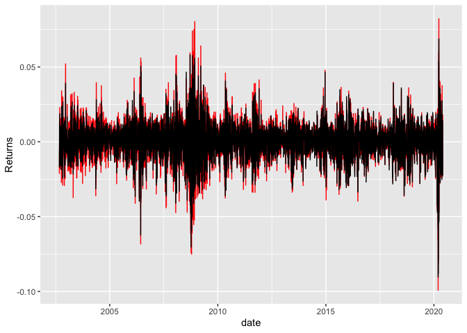
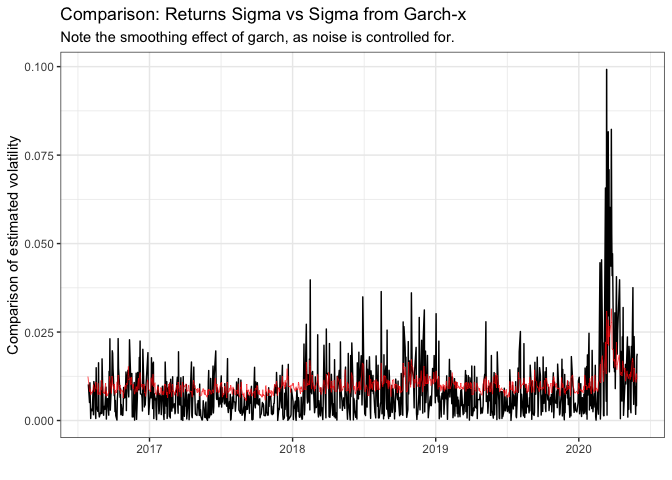

README
================

## Dispersion study

In the data folder, I give you the intra-day dispersion numbers for the
J200 (ALSI Top 40) and J400 (Swix top 40).

Also included is the weekly and 1 and 3 monthly calculated dispersion,
avg stock correlation and avg SD calcs for J200, J400, J300 and J430.
This is a treasure trove of data.

# Dispersion data

``` r
# Intraday dispersion last 4 years:
ID_Disp <- read_rds("data/ID_Disp.rds") %>% filter(date >= as.Date("2016-07-29") & date <= as.Date("2020-05-29"))

ID_Disp %>% 
  ggplot() + 
  geom_line(aes(date, ID_Dispersion_W_J400)) + 
  geom_line(aes(date, ID_Dispersion_W_J200), color = "red")
```

<!-- -->

``` r
# Intraday weighted average realized volatility:
Ivol <- bind_rows(read_rds("data/J200_IVol.rds") %>% select(date, Avg_RV, W_Avg_RV = W_Avg_RV_J200) %>% mutate(Idx = "J200") %>% gather(Type, Value, -date, -Idx), 
                  read_rds("data/J400_IVol.rds") %>% select(date, Avg_RV, W_Avg_RV = W_Avg_RV_J400) %>% mutate(Idx = "J400") %>% gather(Type, Value, -date, -Idx))

Ivol %>% filter(Type == "W_Avg_RV") %>% 
  ggplot() + 
  geom_line(aes(date, Value, color = Idx)) + 
  labs(title = "Weighted Avg Realized Volatility") + theme_bw()
```

<!-- -->

``` r
# Dispersion - lower frequency
W_Dispersion <- 
  read_rds("data/Dispersion/Weekly.rds")
M_Dispersion <- 
  read_rds("data/Dispersion/Monthly.rds")
```

## Importing index returns data

``` r
library(tbl2xts)

# the JSE top 40 index used to create a simple return index

#TP40 <- fmxdat::SA_Indexes %>% filter(Tickers == "JSHRALTR Index") %>% 
#    mutate(SimpleRet = Price / lag(Price)-1) %>% 
#    ungroup() %>% select(date, SimpleRet) %>% tbl2xts::tbl_xts()

# locally storing the TP40 data

# saveRDS(TP40, file = "data/TP40.rds")

TP40n <- read_rds("data/Top40_new.rds")
TP40 <- read_rds("data/TP40.rds")
```

## Calculate returns with new data 15/01/21

``` r
TP40n <- read_rds("data/Top40_new.rds")
rts <- TP40n %>% select(date, Tickers, Return) %>% spread(Tickers, Return) %>% tbl_xts()
wts <- TP40n %>% select(date, Tickers, J200_W_Adj) %>% spread(Tickers, J200_W_Adj) %>% tbl_xts()

wts[is.na(wts)] <- 0
rts[is.na(rts)] <- 0

TP40rts <- Safe_Return.portfolio(R = rts, weights = wts, 
    lag_weights = T) %>% xts_tbl() %>% rename(Returns = portfolio.returns) %>% tbl_xts()
```

    ## Warning in Return.portfolio.geometric(R = R, weights = weights, wealth.index =
    ## wealth.index, : The weights for one or more periods do not sum up to 1: assuming
    ## a return of 0 for the residual weights

``` r
TP40rts_w <- TP40rts %>% apply.weekly(mean)


# visualize the difference between the two returns series 

plot1 <- ID_Disp %>% select(date, ID_Dispersion_W_J200) %>% mutate(Idx = "Intraday Dispersion") %>% 
  gather(Type, Value, -date, -Idx)

plot2 <- ID_Disp %>% left_join(Ivol, by = "date") %>% filter(Idx == "J200", Type == "W_Avg_RV") %>% 
  na.omit() %>% select(date, ID_Dispersion_W_J200, Value) %>% mutate(Idx = "Realized Volatility") %>% 
  select(date, Value, Idx) %>% gather(Type, Value, -date, -Idx)

plot <- bind_rows(plot1, plot2) %>% rename(Date = date)


plotf <- plot %>% 
  ggplot() + 
  geom_line(aes(Date, Value, color = Idx)) + 
  labs(title = "Weighted Avg Realized Volatility", y = "", x = "") + theme_bw() +
  theme(legend.position=c(0.4, 0.87), legend.direction = "vertical", legend.title = element_blank(),
        legend.background = element_rect(fill="white", 
                                  size=0.5, linetype="solid", colour = "black"), legend.text = element_text(size=8)) + ggtitle("")

# save plot for tex 

saveRDS(plotf, file = "plotf")
  

xts_tbl(TP40rts) %>% left_join(xts_tbl(TP40), by = "date") %>% na.omit() %>%
  ggplot() + 
  geom_line(aes(date, Returns), color = "red") +
  geom_line(aes(date, SimpleRet))
```

<!-- -->

# Plotting the returns data

``` r
# plotting the data 

Plotdata <- cbind(TP40rts, TP40rts^2, abs(TP40rts))
colnames(Plotdata) <- c("Returns", "Returns_Sqd", "Returns_Abs")

Plotdata <- Plotdata %>% xts_tbl() %>% gather(ReturnType, Returns,-date) %>%
  filter(date >= as.Date("2016-07-29") & date <= as.Date("2020-07-31"))

ggplot(Plotdata) + geom_line(aes(x = date, y = Returns, colour = ReturnType, 
    alpha = 0.5)) + ggtitle("Return Type Persistence: J200 Index") + 
    facet_wrap(~ReturnType, nrow = 3, ncol = 1, scales = "free") + 
    guides(alpha = FALSE, colour = FALSE) + theme_bw()
```

<!-- -->

## tests

``` r
forecast::Acf(TP40rts, main = "ACF: Equally Weighted Return")
```

<!-- -->

``` r
forecast::Acf(TP40rts^2, main = "ACF: Squared Equally Weighted Return")
```

<!-- -->

``` r
forecast::Acf(abs(TP40rts), main = "ACF: Absolute Equally Weighted Return")
```

<!-- -->

These test prove that there is conditional heteroskedasticity in the
data - there is volatility is clustering.

``` r
Box.test(coredata(TP40rts^2), type = "Ljung-Box", lag = 12)
```

    ## 
    ##  Box-Ljung test
    ## 
    ## data:  coredata(TP40rts^2)
    ## X-squared = 4249.8, df = 12, p-value < 2.2e-16

# Estimating the daily GARCH model

## Simple GARCH on returns

``` r
library(rugarch)

# combining the two datasets to make sure that they line up 


comb <- ID_Disp %>% select(date, ID_Dispersion_W_J200) %>%  left_join(xts_tbl(TP40rts), by="date") %>% na.omit() %>%
  tbl_xts()

combplot <- ID_Disp %>% select(date, ID_Dispersion_W_J200) %>%  left_join(xts_tbl(TP40rts), by="date") %>%
  tbl_xts() %>% na.omit %>% apply.weekly(mean) %>% xts_tbl() %>% 
  rename("Return Dispersion" = ID_Dispersion_W_J200) %>% gather(Type, Value, -date)

# Second plot for tex proj

combplot <- combplot %>% 
  ggplot() + 
  geom_line(aes(date, Value, color = Type)) + 
  labs(title = "Weighted Avg Realized Volatility", y = "", x = "") + theme_bw() +
  theme(legend.position=c(0.4, 0.87), legend.direction = "vertical", legend.title = element_blank(),
        legend.background = element_rect(fill="white", 
                                  size=0.5, linetype="solid", colour = "black"), legend.text = element_text(size=8)) + ggtitle("")

saveRDS(combplot, file = "combplot")


# remove the NAs - temporary solution 

comb[is.na(comb)] <- 0 

colSums(is.na(comb))
```

ID\_Dispersion\_W\_J200 Returns 0 0

``` r
fit <- comb[,2] %>% as.matrix() 


# first fit the simple model to returns 

garch1 <- ugarchspec(variance.model = list(model = c("sGARCH", 
    "gjrGARCH", "eGARCH", "fGARCH", "apARCH")[1], garchOrder = c(1, 
    1), external.regressors = NULL), mean.model = list(armaOrder = c(1, 0), include.mean = TRUE), 
    distribution.model = c("norm", "snorm", "std", "sstd", "ged","sged", "nig", "ghyp", "jsu")[1])

garchfit1 = ugarchfit(spec = garch1, data = fit)

kable(garchfit1@fit$matcoef, format = "html")
```

<table>

<thead>

<tr>

<th style="text-align:left;">

</th>

<th style="text-align:right;">

Estimate

</th>

<th style="text-align:right;">

Std. Error

</th>

<th style="text-align:right;">

t value

</th>

<th style="text-align:right;">

Pr(\>|t|)

</th>

</tr>

</thead>

<tbody>

<tr>

<td style="text-align:left;">

mu

</td>

<td style="text-align:right;">

0.0005580

</td>

<td style="text-align:right;">

0.0002953

</td>

<td style="text-align:right;">

1.8898609

</td>

<td style="text-align:right;">

0.0587766

</td>

</tr>

<tr>

<td style="text-align:left;">

ar1

</td>

<td style="text-align:right;">

\-0.0033671

</td>

<td style="text-align:right;">

0.0349333

</td>

<td style="text-align:right;">

\-0.0963856

</td>

<td style="text-align:right;">

0.9232144

</td>

</tr>

<tr>

<td style="text-align:left;">

omega

</td>

<td style="text-align:right;">

0.0000030

</td>

<td style="text-align:right;">

0.0000023

</td>

<td style="text-align:right;">

1.2937796

</td>

<td style="text-align:right;">

0.1957416

</td>

</tr>

<tr>

<td style="text-align:left;">

alpha1

</td>

<td style="text-align:right;">

0.1028669

</td>

<td style="text-align:right;">

0.0202114

</td>

<td style="text-align:right;">

5.0895407

</td>

<td style="text-align:right;">

0.0000004

</td>

</tr>

<tr>

<td style="text-align:left;">

beta1

</td>

<td style="text-align:right;">

0.8760638

</td>

<td style="text-align:right;">

0.0236913

</td>

<td style="text-align:right;">

36.9783159

</td>

<td style="text-align:right;">

0.0000000

</td>

</tr>

</tbody>

</table>

## Fitting with external regressor

``` r
# identifying the fit and external regressor for the model then fitting it to GARCH-X

exreg <- comb[,1] %>% as.matrix()

garchx <- ugarchspec(variance.model = list(model = c("sGARCH", 
    "gjrGARCH", "eGARCH", "fGARCH", "apARCH")[1], garchOrder = c(1, 
    1), external.regressors = exreg), mean.model = list(armaOrder = c(1, 0), include.mean = TRUE), 
    distribution.model = c("norm", "snorm", "std", "sstd", "ged","sged", "nig", "ghyp", "jsu")[1])

# Now to fit the garch to the returns

garchfitx = ugarchfit(spec = garchx, data = fit)

kable(garchfitx@fit$robust.matcoef, format = "html")
```

<table>

<thead>

<tr>

<th style="text-align:left;">

</th>

<th style="text-align:right;">

Estimate

</th>

<th style="text-align:right;">

Std. Error

</th>

<th style="text-align:right;">

t value

</th>

<th style="text-align:right;">

Pr(\>|t|)

</th>

</tr>

</thead>

<tbody>

<tr>

<td style="text-align:left;">

mu

</td>

<td style="text-align:right;">

\-0.0008489

</td>

<td style="text-align:right;">

0.0004686

</td>

<td style="text-align:right;">

\-1.8115184

</td>

<td style="text-align:right;">

0.0700606

</td>

</tr>

<tr>

<td style="text-align:left;">

ar1

</td>

<td style="text-align:right;">

\-0.0154126

</td>

<td style="text-align:right;">

0.0378068

</td>

<td style="text-align:right;">

\-0.4076666

</td>

<td style="text-align:right;">

0.6835185

</td>

</tr>

<tr>

<td style="text-align:left;">

omega

</td>

<td style="text-align:right;">

0.0000000

</td>

<td style="text-align:right;">

0.0000009

</td>

<td style="text-align:right;">

0.0000000

</td>

<td style="text-align:right;">

1.0000000

</td>

</tr>

<tr>

<td style="text-align:left;">

alpha1

</td>

<td style="text-align:right;">

0.0757268

</td>

<td style="text-align:right;">

0.0537949

</td>

<td style="text-align:right;">

1.4076954

</td>

<td style="text-align:right;">

0.1592213

</td>

</tr>

<tr>

<td style="text-align:left;">

beta1

</td>

<td style="text-align:right;">

0.1347307

</td>

<td style="text-align:right;">

0.2212609

</td>

<td style="text-align:right;">

0.6089224

</td>

<td style="text-align:right;">

0.5425758

</td>

</tr>

<tr>

<td style="text-align:left;">

vxreg1

</td>

<td style="text-align:right;">

0.0038079

</td>

<td style="text-align:right;">

0.0015593

</td>

<td style="text-align:right;">

2.4419870

</td>

<td style="text-align:right;">

0.0146067

</td>

</tr>

</tbody>

</table>

``` r
# save the first two garch objects for the tex 

saveRDS(garchfitx, file = "garchfitx")
saveRDS(garchfit1, file = "garchfit1")
```

## Veiw the two conditional variance plots

``` r
# First for the garch-x
sigmax <- sigma(garchfitx) %>% xts_tbl()
colnames(sigmax) <- c("date", "sigma")
sigmax <- sigmax %>% mutate(date = as.Date(date))


ggplot() + geom_line(data = Plotdata %>% filter(ReturnType == 
    "Returns_Sqd") %>% select(date, Returns) %>% unique %>% mutate(Returns = sqrt(Returns)), 
    aes(x = date, y = Returns)) + geom_line(data = sigmax, aes(x = date, 
    y = sigma), color = "red", size = 0.3, alpha = 0.8) + theme_bw() + 
    # scale_y_continuous(limits = c(0, 0.35)) +
labs(title = "Comparison: Returns Sigma vs Sigma from Garch-x", 
    subtitle = "Note the smoothing effect of garch, as noise is controlled for.", 
    x = "", y = "Comparison of estimated volatility")
```

<!-- -->

``` r
# now for the garch

sigma <- sigma(garchfit1) %>% xts_tbl()
colnames(sigma) <- c("date", "sigma")
sigma <- sigma %>% mutate(date = as.Date(date))

ggplot() + geom_line(data = Plotdata %>% filter(ReturnType == 
    "Returns_Sqd") %>% select(date, Returns) %>% unique %>% mutate(Returns = sqrt(Returns)), 
    aes(x = date, y = Returns)) + geom_line(data = sigma, aes(x = date, 
    y = sigma), color = "red", size = 1, alpha = 0.8) + theme_bw() + 
    # scale_y_continuous(limits = c(0, 0.35)) +
labs(title = "Comparison: Returns Sigma vs Sigma from Garch", 
    subtitle = "Note the smoothing effect of garch, as noise is controlled for.", 
    x = "", y = "Comparison of estimated volatility")
```

<!-- -->

``` r
plot(garchfitx, which = 'all')
```

    ## 
    ## please wait...calculating quantiles...

<!-- -->

``` r
plot(garchfit1, which = 'all')
```

    ## 
    ## please wait...calculating quantiles...

<!-- -->

``` r
persistence(garchfitx)
```

    ## [1] 0.2104575

``` r
# testing the fit 

fit.ic <- cbind(infocriteria(garchfit1),infocriteria(garchfitx)) 

colnames(fit.ic) <-c("GARCH","GARCH-X")

kable(fit.ic)
```

|              |      GARCH |    GARCH-X |
| :----------- | ---------: | ---------: |
| Akaike       | \-6.338292 | \-6.385141 |
| Bayes        | \-6.312796 | \-6.354545 |
| Shibata      | \-6.338347 | \-6.385219 |
| Hannan-Quinn | \-6.328579 | \-6.373485 |

## Forecasting with daily data

``` r
# forecast

garchxfor <- ugarchforecast(garchfitx, data = fit, n.ahead = 10, n.roll = 0, out.sample = 100, external.forecasts = list(mregfor=NULL, vregfor=exreg))

garchfor <- ugarchforecast(garchfit1, n.ahead = 10)


# forecast sigmas:
f1 <-as.data.frame(sigma(garchfor))

f2 <-as.data.frame(sigma(garchxfor))

series1 <- fitted(garchfor)

series2 <- fitted(garchxfor)

sigmaf <- cbind(f1, f2)

fitf <-cbind(series1, series2)

vol <- sigmaf^2

colnames(vol) <- c("GARCH", "GARCH-X")

kable(vol)
```

|      |     GARCH |   GARCH-X |
| :--- | --------: | --------: |
| T+1  | 0.0002499 | 0.0000971 |
| T+2  | 0.0002476 | 0.0000845 |
| T+3  | 0.0002454 | 0.0000701 |
| T+4  | 0.0002432 | 0.0000793 |
| T+5  | 0.0002411 | 0.0000576 |
| T+6  | 0.0002390 | 0.0000694 |
| T+7  | 0.0002369 | 0.0000706 |
| T+8  | 0.0002349 | 0.0000845 |
| T+9  | 0.0002330 | 0.0001085 |
| T+10 | 0.0002311 | 0.0000655 |

## Testing the forecasting accuracy for the two models

``` r
cl = makePSOCKcluster(10)


roll = ugarchroll(garch1, fit, forecast.length = 500, refit.every = 25, 
    refit.window = "moving", window.size = 600, calculate.VaR = TRUE, 
    VaR.alpha = c(0.01, 0.05), keep.coef = TRUE, cluster = cl)

rollx = ugarchroll(garchx, fit, forecast.length = 500, refit.every = 25, 
    refit.window = "moving", window.size = 600, calculate.VaR = TRUE, 
    VaR.alpha = c(0.01, 0.05), keep.coef = TRUE, cluster = cl)

# For this, only 1-step ahead can be done automatically.
show(rollx)
```

    ## 
    ## *-------------------------------------*
    ## *              GARCH Roll             *
    ## *-------------------------------------*
    ## No.Refits        : 20
    ## Refit Horizon    : 25
    ## No.Forecasts : 500
    ## GARCH Model      : sGARCH(1,1)
    ## Distribution : norm 
    ## 
    ## Forecast Density:
    ##                 Mu  Sigma Skew Shape Shape(GIG) Realized
    ## 2018-05-28 -0.0009 0.0066    0     0          0   0.0002
    ## 2018-05-29 -0.0008 0.0075    0     0          0  -0.0184
    ## 2018-05-30 -0.0006 0.0066    0     0          0  -0.0068
    ## 2018-05-31 -0.0007 0.0086    0     0          0   0.0101
    ## 2018-06-01 -0.0010 0.0124    0     0          0   0.0219
    ## 2018-06-04 -0.0012 0.0089    0     0          0   0.0104
    ## 
    ## ..........................
    ##                Mu  Sigma Skew Shape Shape(GIG) Realized
    ## 2020-05-22 -7e-04 0.0162    0     0          0  -0.0169
    ## 2020-05-25 -7e-04 0.0144    0     0          0  -0.0017
    ## 2020-05-26 -6e-04 0.0130    0     0          0   0.0096
    ## 2020-05-27 -6e-04 0.0121    0     0          0  -0.0042
    ## 2020-05-28 -6e-04 0.0129    0     0          0   0.0180
    ## 2020-05-29 -6e-04 0.0134    0     0          0  -0.0189
    ## 
    ## Elapsed: 4.10967 secs

``` r
report(rollx, type = "fpm")
```

    ## 
    ## GARCH Roll Mean Forecast Performance Measures
    ## ---------------------------------------------
    ## Model        : sGARCH
    ## No.Refits    : 20
    ## No.Forecasts: 500
    ## 
    ##         Stats
    ## MSE 0.0002261
    ## MAE 0.0099560
    ## DAC 0.5000000

``` r
report(roll, type = "fpm")
```

    ## 
    ## GARCH Roll Mean Forecast Performance Measures
    ## ---------------------------------------------
    ## Model        : sGARCH
    ## No.Refits    : 20
    ## No.Forecasts: 500
    ## 
    ##         Stats
    ## MSE 0.0002276
    ## MAE 0.0099470
    ## DAC 0.4800000

## Run an AR(1) on

``` r
arima(TP40, order = c(1, 0, 1))
```

    ## 
    ## Call:
    ## arima(x = TP40, order = c(1, 0, 1))
    ## 
    ## Coefficients:
    ##          ar1     ma1  intercept
    ##       0.0079  0.0088      6e-04
    ## s.e.  0.8269  0.8424      2e-04
    ## 
    ## sigma^2 estimated as 0.0001303:  log likelihood = 14179.28,  aic = -28350.56

``` r
arima(exreg, order = c(1, 0, 0))
```

    ## 
    ## Call:
    ## arima(x = exreg, order = c(1, 0, 0))
    ## 
    ## Coefficients:
    ##          ar1  intercept
    ##       0.5457     0.0215
    ## s.e.  0.0271     0.0007
    ## 
    ## sigma^2 estimated as 0.0001093:  log likelihood = 2993.94,  aic = -5981.88

# Esitmating weekly data on the GARCH model

``` r
# The two series for the model

comb2 <- comb %>% xts_tbl() %>% select(date, Returns) %>% tbl_xts() %>% apply.weekly(mean)

combmain <- ID_Disp %>% select(date, ID_Dispersion_W_J200) %>% tbl_xts() %>% apply.weekly(mean) %>% 
  xts_tbl() %>% left_join(xts_tbl(comb2), by = "date") %>% na.omit() %>% tbl_xts()

# check na's
colSums(is.na(combmain))
```

    ## ID_Dispersion_W_J200              Returns 
    ##                    0                    0

``` r
fitw <- combmain[,2]
exregw <- combmain[,1]

# model weekly vol with ext reg

garchweekly <- ugarchspec(variance.model = list(model = "sGARCH", garchOrder = c(1, 
    1), external.regressors = NULL), mean.model = list(armaOrder = c(1, 0), include.mean = TRUE), 
    distribution.model = "norm")

garchx2 <- ugarchspec(variance.model = list(model = "sGARCH", garchOrder = c(1, 
    1), external.regressors = exregw), mean.model = list(armaOrder = c(1, 0), include.mean = TRUE), 
    distribution.model = "norm")

garchfit2 <- ugarchfit(spec = garchweekly, data = fitw)

garchfitx2 <- ugarchfit(spec = garchx2, data = fitw)

# saving the output for the tex proj

saveRDS(garchfit2, file = "garchfitw")
saveRDS(garchfitx2, file = "garchfitwx")
```

## Weekly data output

``` r
kable(garchfit2@fit$matcoef, format = "html")
```

<table>

<thead>

<tr>

<th style="text-align:left;">

</th>

<th style="text-align:right;">

Estimate

</th>

<th style="text-align:right;">

Std. Error

</th>

<th style="text-align:right;">

t value

</th>

<th style="text-align:right;">

Pr(\>|t|)

</th>

</tr>

</thead>

<tbody>

<tr>

<td style="text-align:left;">

mu

</td>

<td style="text-align:right;">

0.0003648

</td>

<td style="text-align:right;">

0.0003161

</td>

<td style="text-align:right;">

1.1541228

</td>

<td style="text-align:right;">

0.2484498

</td>

</tr>

<tr>

<td style="text-align:left;">

ar1

</td>

<td style="text-align:right;">

0.0272471

</td>

<td style="text-align:right;">

0.0827803

</td>

<td style="text-align:right;">

0.3291501

</td>

<td style="text-align:right;">

0.7420422

</td>

</tr>

<tr>

<td style="text-align:left;">

omega

</td>

<td style="text-align:right;">

0.0000062

</td>

<td style="text-align:right;">

0.0000003

</td>

<td style="text-align:right;">

19.5760659

</td>

<td style="text-align:right;">

0.0000000

</td>

</tr>

<tr>

<td style="text-align:left;">

alpha1

</td>

<td style="text-align:right;">

0.2181874

</td>

<td style="text-align:right;">

0.0525276

</td>

<td style="text-align:right;">

4.1537652

</td>

<td style="text-align:right;">

0.0000327

</td>

</tr>

<tr>

<td style="text-align:left;">

beta1

</td>

<td style="text-align:right;">

0.5427257

</td>

<td style="text-align:right;">

0.0600491

</td>

<td style="text-align:right;">

9.0380313

</td>

<td style="text-align:right;">

0.0000000

</td>

</tr>

</tbody>

</table>

``` r
kable(garchfitx2@fit$matcoef, format = "html")
```

<table>

<thead>

<tr>

<th style="text-align:left;">

</th>

<th style="text-align:right;">

Estimate

</th>

<th style="text-align:right;">

Std. Error

</th>

<th style="text-align:right;">

t value

</th>

<th style="text-align:right;">

Pr(\>|t|)

</th>

</tr>

</thead>

<tbody>

<tr>

<td style="text-align:left;">

mu

</td>

<td style="text-align:right;">

\-0.0000589

</td>

<td style="text-align:right;">

0.0003306

</td>

<td style="text-align:right;">

\-0.1782899

</td>

<td style="text-align:right;">

0.8584953

</td>

</tr>

<tr>

<td style="text-align:left;">

ar1

</td>

<td style="text-align:right;">

0.0455119

</td>

<td style="text-align:right;">

0.0710241

</td>

<td style="text-align:right;">

0.6407947

</td>

<td style="text-align:right;">

0.5216561

</td>

</tr>

<tr>

<td style="text-align:left;">

omega

</td>

<td style="text-align:right;">

0.0000000

</td>

<td style="text-align:right;">

0.0000030

</td>

<td style="text-align:right;">

0.0000000

</td>

<td style="text-align:right;">

1.0000000

</td>

</tr>

<tr>

<td style="text-align:left;">

alpha1

</td>

<td style="text-align:right;">

0.0047124

</td>

<td style="text-align:right;">

0.0158530

</td>

<td style="text-align:right;">

0.2972587

</td>

<td style="text-align:right;">

0.7662690

</td>

</tr>

<tr>

<td style="text-align:left;">

beta1

</td>

<td style="text-align:right;">

0.0028170

</td>

<td style="text-align:right;">

0.1320365

</td>

<td style="text-align:right;">

0.0213351

</td>

<td style="text-align:right;">

0.9829784

</td>

</tr>

<tr>

<td style="text-align:left;">

vxreg1

</td>

<td style="text-align:right;">

0.0010326

</td>

<td style="text-align:right;">

0.0001347

</td>

<td style="text-align:right;">

7.6676934

</td>

<td style="text-align:right;">

0.0000000

</td>

</tr>

</tbody>

</table>

``` r
LLH <- cbind(garchfit2@fit$LLH, garchfitx2@fit$LLH)
colnames(LLH) <- c("GARCH", "GARCH-X")

kable(LLH, format = "html")
```

<table>

<thead>

<tr>

<th style="text-align:right;">

GARCH

</th>

<th style="text-align:right;">

GARCH-X

</th>

</tr>

</thead>

<tbody>

<tr>

<td style="text-align:right;">

778.4661

</td>

<td style="text-align:right;">

787.631

</td>

</tr>

</tbody>

</table>

``` r
fit.ic2 <- cbind(infocriteria(garchfit2),infocriteria(garchfitx2)) 

colnames(fit.ic2) <-c("GARCH","GARCH-X")

kable(fit.ic2)
```

|              |      GARCH |    GARCH-X |
| :----------- | ---------: | ---------: |
| Akaike       | \-7.773529 | \-7.855588 |
| Bayes        | \-7.690782 | \-7.756292 |
| Shibata      | \-7.774751 | \-7.857336 |
| Hannan-Quinn | \-7.740039 | \-7.815401 |

``` r
# The two models show that the garch-x has a higher maximum likelhood and 
# therefore a improved goodness of fit with the dispersion measure included 
```

## Weekly forecast vol with the two models

``` r
garchfx_w <- ugarchforecast(garchfitx2, n.ahead = 10)
garchf2 <- ugarchforecast(garchfit2, n.ahead = 10)

plot(garchfx_w, which = 1)
```

<!-- -->

``` r
plot(garchf2, which = 1)
```

<!-- -->

``` r
plot(garchfx_w, which = 3)
```

<!-- -->

``` r
plot(garchf2, which = 3)
```

<!-- -->

``` r
# rolling forecast

cl <- makePSOCKcluster(10)
# Thus the model spec is a ARIMA(1,1,0)-GJRGARCH(1,1), with
# normal distribution

roll2 <- ugarchroll(garchweekly, fitw, forecast.length = 100, refit.every = 50, 
    refit.window = "moving", window.size = 120, calculate.VaR = TRUE, 
    VaR.alpha = c(0.01, 0.05), keep.coef = TRUE, cluster = cl)

# For this, only 1-step ahead can be done automatically.
show(roll2)
```

    ## 
    ## *-------------------------------------*
    ## *              GARCH Roll             *
    ## *-------------------------------------*
    ## No.Refits        : 2
    ## Refit Horizon    : 50
    ## No.Forecasts : 100
    ## GARCH Model      : sGARCH(1,1)
    ## Distribution : norm 
    ## 
    ## Forecast Density:
    ##               Mu  Sigma Skew Shape Shape(GIG) Realized
    ## 2018-06-22 3e-04 0.0041    0     0          0  -0.0025
    ## 2018-06-29 3e-04 0.0041    0     0          0   0.0036
    ## 2018-07-13 2e-04 0.0041    0     0          0  -0.0034
    ## 2018-07-20 4e-04 0.0041    0     0          0   0.0027
    ## 2018-07-27 2e-04 0.0041    0     0          0   0.0010
    ## 2018-08-03 3e-04 0.0041    0     0          0  -0.0005
    ## 
    ## ..........................
    ##               Mu  Sigma Skew Shape Shape(GIG) Realized
    ## 2020-04-24 3e-04 0.0048    0     0          0   0.0029
    ## 2020-04-30 3e-04 0.0048    0     0          0   0.0055
    ## 2020-05-08 3e-04 0.0048    0     0          0   0.0032
    ## 2020-05-15 3e-04 0.0048    0     0          0  -0.0047
    ## 2020-05-22 5e-04 0.0048    0     0          0   0.0023
    ## 2020-05-29 3e-04 0.0048    0     0          0   0.0006
    ## 
    ## Elapsed: 11.58634 secs

``` r
report(roll2, type = "fpm")
```

    ## 
    ## GARCH Roll Mean Forecast Performance Measures
    ## ---------------------------------------------
    ## Model        : sGARCH
    ## No.Refits    : 2
    ## No.Forecasts: 100
    ## 
    ##         Stats
    ## MSE 4.339e-05
    ## MAE 4.555e-03
    ## DAC 5.600e-01

``` r
# Thus the model spec is a ARIMA(1,1,0)-GJRGARCH(1,1), with
# normal distribution

rollxw = ugarchroll(garchx2, fitw, forecast.length = 100, refit.every = 15, 
    refit.window = "moving", window.size = 150, calculate.VaR = TRUE, 
    VaR.alpha = c(0.01, 0.05), keep.coef = TRUE, cluster = cl)

rollw = ugarchroll(garchweekly, fitw, forecast.length = 100, refit.every = 15, 
    refit.window = "moving", window.size = 150, calculate.VaR = TRUE, 
    VaR.alpha = c(0.01, 0.05), keep.coef = TRUE, cluster = cl)


report(rollxw, type = "fpm")
```

    ## 
    ## GARCH Roll Mean Forecast Performance Measures
    ## ---------------------------------------------
    ## Model        : sGARCH
    ## No.Refits    : 7
    ## No.Forecasts: 100
    ## 
    ##         Stats
    ## MSE 4.372e-05
    ## MAE 4.587e-03
    ## DAC 5.000e-01

``` r
report(rollw, type = "fpm")
```

    ## 
    ## GARCH Roll Mean Forecast Performance Measures
    ## ---------------------------------------------
    ## Model        : sGARCH
    ## No.Refits    : 7
    ## No.Forecasts: 100
    ## 
    ##         Stats
    ## MSE 4.314e-05
    ## MAE 4.546e-03
    ## DAC 5.200e-01

# Estimating monthly data on the GARCH

``` r
M_Dispersion <- 
  read_rds("data/Dispersion/Monthly.rds")

TP40rts_m <- TP40rts %>% apply.monthly(Return.cumulative) %>% xts_tbl()


Monthly <- M_Dispersion %>% filter(Idx == "J200_W_Adj", Freq == "1_Month") %>% left_join(TP40rts_m, by = "date") %>% 
  select(date, Dispersion_W, Returns) %>% na.omit() %>% tbl_xts() 

plot.xts(Monthly$Returns)
```

<!-- -->

``` r
fitm <- Monthly[,2]
exregm <- Monthly[,1]

garchxm <- ugarchspec(variance.model = list(model = "sGARCH", garchOrder = c(1, 
    1), external.regressors = exregm), mean.model = list(armaOrder = c(1, 0), include.mean = TRUE), 
    distribution.model = "norm")

garchm <-  ugarchspec(variance.model = list(model = "sGARCH", garchOrder = c(1, 
    1), external.regressors = NULL), mean.model = list(armaOrder = c(1, 0), include.mean = TRUE), 
    distribution.model = "norm")


garchfitx4 <- ugarchfit(spec = garchxm, data = fitm)
garchfit3 <- ugarchfit(spec = garchm, data = fitm)

kable(garchfit3@fit$matcoef, format = "html")
```

<table>

<thead>

<tr>

<th style="text-align:left;">

</th>

<th style="text-align:right;">

Estimate

</th>

<th style="text-align:right;">

Std. Error

</th>

<th style="text-align:right;">

t value

</th>

<th style="text-align:right;">

Pr(\>|t|)

</th>

</tr>

</thead>

<tbody>

<tr>

<td style="text-align:left;">

mu

</td>

<td style="text-align:right;">

0.0141350

</td>

<td style="text-align:right;">

0.0024957

</td>

<td style="text-align:right;">

5.663847

</td>

<td style="text-align:right;">

0.0000000

</td>

</tr>

<tr>

<td style="text-align:left;">

ar1

</td>

<td style="text-align:right;">

\-0.1389197

</td>

<td style="text-align:right;">

0.0714951

</td>

<td style="text-align:right;">

\-1.943067

</td>

<td style="text-align:right;">

0.0520081

</td>

</tr>

<tr>

<td style="text-align:left;">

omega

</td>

<td style="text-align:right;">

0.0003222

</td>

<td style="text-align:right;">

0.0001793

</td>

<td style="text-align:right;">

1.796925

</td>

<td style="text-align:right;">

0.0723475

</td>

</tr>

<tr>

<td style="text-align:left;">

alpha1

</td>

<td style="text-align:right;">

0.2812345

</td>

<td style="text-align:right;">

0.1021832

</td>

<td style="text-align:right;">

2.752257

</td>

<td style="text-align:right;">

0.0059186

</td>

</tr>

<tr>

<td style="text-align:left;">

beta1

</td>

<td style="text-align:right;">

0.5915480

</td>

<td style="text-align:right;">

0.1326657

</td>

<td style="text-align:right;">

4.458939

</td>

<td style="text-align:right;">

0.0000082

</td>

</tr>

</tbody>

</table>

``` r
kable(garchfitx4@fit$matcoef, format = "html")
```

<table>

<thead>

<tr>

<th style="text-align:left;">

</th>

<th style="text-align:right;">

Estimate

</th>

<th style="text-align:right;">

Std. Error

</th>

<th style="text-align:right;">

t value

</th>

<th style="text-align:right;">

Pr(\>|t|)

</th>

</tr>

</thead>

<tbody>

<tr>

<td style="text-align:left;">

mu

</td>

<td style="text-align:right;">

0.0140782

</td>

<td style="text-align:right;">

0.0025632

</td>

<td style="text-align:right;">

5.4923251

</td>

<td style="text-align:right;">

0.0000000

</td>

</tr>

<tr>

<td style="text-align:left;">

ar1

</td>

<td style="text-align:right;">

\-0.1361970

</td>

<td style="text-align:right;">

0.0732998

</td>

<td style="text-align:right;">

\-1.8580813

</td>

<td style="text-align:right;">

0.0631575

</td>

</tr>

<tr>

<td style="text-align:left;">

omega

</td>

<td style="text-align:right;">

0.0000000

</td>

<td style="text-align:right;">

0.0000633

</td>

<td style="text-align:right;">

0.0000066

</td>

<td style="text-align:right;">

0.9999947

</td>

</tr>

<tr>

<td style="text-align:left;">

alpha1

</td>

<td style="text-align:right;">

0.2444491

</td>

<td style="text-align:right;">

0.1044185

</td>

<td style="text-align:right;">

2.3410527

</td>

<td style="text-align:right;">

0.0192295

</td>

</tr>

<tr>

<td style="text-align:left;">

beta1

</td>

<td style="text-align:right;">

0.5182669

</td>

<td style="text-align:right;">

0.1896218

</td>

<td style="text-align:right;">

2.7331617

</td>

<td style="text-align:right;">

0.0062730

</td>

</tr>

<tr>

<td style="text-align:left;">

vxreg1

</td>

<td style="text-align:right;">

0.0081362

</td>

<td style="text-align:right;">

0.0051910

</td>

<td style="text-align:right;">

1.5673698

</td>

<td style="text-align:right;">

0.1170283

</td>

</tr>

</tbody>

</table>

``` r
LLH2 <- cbind(garchfit3@fit$LLH, garchfitx4@fit$LLH)
colnames(LLH2) <- c("GARCH", "GARCH-X")

kable(LLH2, format = "html")
```

<table>

<thead>

<tr>

<th style="text-align:right;">

GARCH

</th>

<th style="text-align:right;">

GARCH-X

</th>

</tr>

</thead>

<tbody>

<tr>

<td style="text-align:right;">

358.62

</td>

<td style="text-align:right;">

360.2082

</td>

</tr>

</tbody>

</table>

``` r
fit.ic3 <- cbind(infocriteria(garchfit3),infocriteria(garchfitx4)) 

colnames(fit.ic3) <-c("GARCH","GARCH-X")

kable(fit.ic3)
```

|              |      GARCH |    GARCH-X |
| :----------- | ---------: | ---------: |
| Akaike       | \-3.336038 | \-3.341587 |
| Bayes        | \-3.256873 | \-3.246589 |
| Shibata      | \-3.337117 | \-3.343131 |
| Hannan-Quinn | \-3.304042 | \-3.303191 |

``` r
# save the output for the tex proj

saveRDS(garchfit3, file = "garchfitm")
saveRDS(garchfitx4, file = "garchfitmx")
```

## fit the forecasts for monthly data

``` r
garchfx_m <- ugarchforecast(garchfitx4, n.ahead = 10)
garchfm <- ugarchforecast(garchfit3, n.ahead = 10)

plot(garchfx_m, which = 1)
```

<!-- -->

``` r
plot(garchfm, which = 1)
```

<!-- -->

``` r
plot(garchfx_w, which = 3)
```

<!-- -->

``` r
plot(garchf2, which = 3)
```

<!-- -->

``` r
# rolling forecast

cl <- makePSOCKcluster(10)
# Thus the model spec is a ARIMA(1,1,0)-GJRGARCH(1,1), with
# normal distribution

rollxm = ugarchroll(garchxm, fitm, forecast.length = 50, refit.every = 5, 
    refit.window = "moving", window.size = 100, calculate.VaR = TRUE, 
    VaR.alpha = c(0.01, 0.05), keep.coef = TRUE, cluster = cl)

rollm = ugarchroll(garchm, fitm, forecast.length = 50, refit.every = 5, 
    refit.window = "moving", window.size = 100, calculate.VaR = TRUE, 
    VaR.alpha = c(0.01, 0.05), keep.coef = TRUE, cluster = cl)

report(rollxm, type = "fpm")
```

    ## 
    ## GARCH Roll Mean Forecast Performance Measures
    ## ---------------------------------------------
    ## Model        : sGARCH
    ## No.Refits    : 10
    ## No.Forecasts: 50
    ## 
    ##        Stats
    ## MSE 0.001972
    ## MAE 0.035280
    ## DAC 0.480000

``` r
report(rollm, type = "fpm")
```

    ## 
    ## GARCH Roll Mean Forecast Performance Measures
    ## ---------------------------------------------
    ## Model        : sGARCH
    ## No.Refits    : 10
    ## No.Forecasts: 50
    ## 
    ##        Stats
    ## MSE 0.001976
    ## MAE 0.035360
    ## DAC 0.480000

# Truncate the sample

## In daily format

``` r
RvolJ200 <- Ivol %>% filter(Idx == "J200", Type == "W_Avg_RV") %>% 
  mutate(Qlow = quantile(Value, 0.15), Qhigh = quantile(Value, 0.85)) %>% 
  mutate(HighVol = ifelse(Value > Qhigh, "High", ifelse(Value < Qlow, "Low", "Neutral")))

# make nas zero, temp solution

ID_dispJ200 <- ID_Disp %>% select(date, ID_Dispersion_W_J200) %>% na.omit() %>% 
  mutate(Qlow = quantile(ID_Dispersion_W_J200, 0.15), Qhigh = quantile(ID_Dispersion_W_J200, 0.85)) %>% 
  mutate(HighVol = ifelse(ID_Dispersion_W_J200 > Qhigh, "High", ifelse(ID_Dispersion_W_J200 < Qlow, "Low", "Neutral")))

# confusion matrix/contingency table

ID_dispJ200 %>% select(date, HighVol) %>% rename(Intraday_vol = HighVol) %>% 
  left_join(RvolJ200, by = "date") %>% rename(RealV_vol = HighVol) %>% select(Intraday_vol, RealV_vol) %>% 
  mutate(Intraday_vol = factor(Intraday_vol, levels = c("High","Neutral", "Low")), 
         RealV_vol = factor(RealV_vol, levels = c("High","Neutral", "Low"))) %>% table() %>% kable()
```

|         | High | Neutral | Low |
| :------ | ---: | ------: | --: |
| High    |   78 |      65 |   0 |
| Neutral |   60 |     516 |  91 |
| Low     |    1 |      79 |  63 |

``` r
#install.packages("caret")
#library(caret)
```

## In weekly format

``` r
# Truncate the weekly sample

RvolJ200w <- Ivol %>% filter(Idx == "J200", Type == "W_Avg_RV") %>% tbl_xts() %>% 
  xts_tbl() %>% mutate(Qlow = quantile(Value, 0.15), Qhigh = quantile(Value, 0.70)) %>% 
    mutate(HighVol = ifelse(Value > Qhigh, "High", ifelse(Value < Qlow, "Low", "Neutral"))) 

# remove the nas from the sample

dispJ200w <- W_Dispersion %>% filter(Idx == "J200_W_Adj") %>% select(date, Dispersion_W) %>%
  na.omit() %>% mutate(Qlow = quantile(Dispersion_W, 0.15), Qhigh = quantile(Dispersion_W, 0.85)) %>% 
  mutate(HighVol = ifelse(Dispersion_W > Qhigh, "High", ifelse(Dispersion_W < Qlow, "Low", "Neutral")))

# confusion matrix of the different periods of volatility

dispJ200w %>% select(date, HighVol) %>% rename(Intraday_vol = HighVol) %>% 
  left_join(RvolJ200w, by = "date") %>% rename(RealV_vol = HighVol) %>% select(Intraday_vol, RealV_vol) %>% 
  mutate(Intraday_vol = factor(Intraday_vol, levels = c("High","Neutral", "Low")), 
         RealV_vol = factor(RealV_vol, levels = c("High","Neutral", "Low"))) %>% table() %>% kable()
```

|         | High | Neutral | Low |
| :------ | ---: | ------: | --: |
| High    |   35 |      19 |   2 |
| Neutral |   42 |     101 |  31 |
| Low     |    5 |       6 |   4 |

## The mean of the different dispersion vol regimes

``` r
# daily

ID_dispJ200 %>% select(date, HighVol) %>% rename(Intraday_vol = HighVol) %>% 
  left_join(RvolJ200, by = "date") %>% mutate(Intraday_vol = factor(Intraday_vol, levels = c("High","Neutral", "Low")), 
         HighVol = factor(HighVol, levels = c("High","Neutral", "Low"))) %>% with(tapply(Value, Intraday_vol, max)) 
```

    ##       High    Neutral        Low 
    ## 0.08328793 0.09640072 0.02600567

``` r
# weekly

dispJ200w %>% select(date, HighVol) %>% rename(Intraday_vol = HighVol) %>% 
  left_join(RvolJ200w, by = "date") %>% na.omit() %>%
  mutate(Intraday_vol = factor(Intraday_vol, levels = c("High","Neutral","Low")), 
         HighVol = factor(HighVol, levels = c("High","Neutral", "Low"))) %>% 
  with(tapply(Value, Intraday_vol, mean)) %>% kable()
```

|         |         x |
| :------ | --------: |
| High    | 0.0217018 |
| Neutral | 0.0170670 |
| Low     | 0.0163538 |

# Stratfication test

``` r
J200dispw <- ID_Disp %>% select(date, ID_Dispersion_W_J200) %>% na.omit() %>% 
  rename(Disp = ID_Dispersion_W_J200) %>% tbl_xts() %>% apply.weekly(mean) %>% 
  xts_tbl() %>% mutate(Qlow = quantile(Disp, 0.20), Qhigh = quantile(Disp ,0.55)) %>% 
  mutate(HighVol = ifelse(Disp > Qhigh, "High", ifelse(Disp < Qlow, "Low", "Neutral")))

highdisp <- J200dispw %>% filter(HighVol == "High") %>% select(date, Disp) %>% 
  left_join(xts_tbl(comb2), by = "date")

J200dispw %>% na.omit() %>%
  ggplot() + 
  geom_line(aes(date, Disp)) + 
  geom_line(aes(date, Qlow), color = "red") +
  geom_line(aes(date, Qhigh), color = "blue") 
```

<!-- -->

# dummy variables

``` r
TP40dummy <- TP40rts_w %>% xts_tbl() %>% 
  mutate(Qlow = quantile(Returns, 0.15), Qhigh = quantile(Returns, 0.75)) %>% 
  mutate(HighVol = ifelse(Returns > Qhigh, "High", ifelse(Returns < Qlow, "Low", "Neutral"))) %>%
  mutate(dummy = ifelse(HighVol=="High", 1, 0))

RvolJ200w1 <- RvolJ200w %>% select(date, Value) %>% tbl_xts()

Hdummy <- J200dispw %>%  mutate(dummy = ifelse(J200dispw$HighVol=="High", 1, 0)) %>% 
  select(date, dummy) %>% left_join(xts_tbl(TP40rts_w), by = "date") %>% na.omit() %>% 
  select(dummy) %>% as.matrix()

J200dispw %>%  mutate(dummy = ifelse(J200dispw$HighVol=="Low", 1, NA)) %>% 
  select(date, dummy) %>% left_join(xts_tbl(TP40rts_w), by = "date") %>% na.omit() %>% 
  select(Returns) %>% as.matrix() %>% abs() %>% mean()
```

    ## [1] 0.002370396

``` r
Ndummy <- J200dispw %>%  mutate(dummyn = ifelse(J200dispw$HighVol=="Neutral", 1, 0)) %>% 
  select(date, dummyn) %>%  left_join(xts_tbl(TP40rts_w), by = "date") %>% select(dummyn)
  
Ldummy <- J200dispw %>%  mutate(dummyl = ifelse(J200dispw$HighVol=="Low", 1, 0)) %>% 
  na.omit() %>% select(dummyl) %>% as.matrix()

exregdum <- cbind(Hdummy, Ndummy, Ldummy) %>% as.matrix()


garchx3 <- ugarchspec(variance.model = list(model = "sGARCH", garchOrder = c(1, 
    1), external.regressors = Hdummy), mean.model = list(armaOrder = c(1, 0), include.mean = TRUE), 
    distribution.model = "norm")

garchfitx3 <- ugarchfit(spec = garchx3, data = fitw)


kable(garchfitx3@fit$matcoef, format = "html")
```

<table>

<thead>

<tr>

<th style="text-align:left;">

</th>

<th style="text-align:right;">

Estimate

</th>

<th style="text-align:right;">

Std. Error

</th>

<th style="text-align:right;">

t value

</th>

<th style="text-align:right;">

Pr(\>|t|)

</th>

</tr>

</thead>

<tbody>

<tr>

<td style="text-align:left;">

mu

</td>

<td style="text-align:right;">

0.0002776

</td>

<td style="text-align:right;">

0.0003213

</td>

<td style="text-align:right;">

0.8641488

</td>

<td style="text-align:right;">

0.3875061

</td>

</tr>

<tr>

<td style="text-align:left;">

ar1

</td>

<td style="text-align:right;">

0.0384956

</td>

<td style="text-align:right;">

0.0454652

</td>

<td style="text-align:right;">

0.8467042

</td>

<td style="text-align:right;">

0.3971600

</td>

</tr>

<tr>

<td style="text-align:left;">

omega

</td>

<td style="text-align:right;">

0.0000052

</td>

<td style="text-align:right;">

0.0000005

</td>

<td style="text-align:right;">

9.5855624

</td>

<td style="text-align:right;">

0.0000000

</td>

</tr>

<tr>

<td style="text-align:left;">

alpha1

</td>

<td style="text-align:right;">

0.1950435

</td>

<td style="text-align:right;">

0.0471993

</td>

<td style="text-align:right;">

4.1323394

</td>

<td style="text-align:right;">

0.0000359

</td>

</tr>

<tr>

<td style="text-align:left;">

beta1

</td>

<td style="text-align:right;">

0.4511721

</td>

<td style="text-align:right;">

0.0544628

</td>

<td style="text-align:right;">

8.2840440

</td>

<td style="text-align:right;">

0.0000000

</td>

</tr>

<tr>

<td style="text-align:left;">

vxreg1

</td>

<td style="text-align:right;">

0.0000088

</td>

<td style="text-align:right;">

0.0000002

</td>

<td style="text-align:right;">

54.2004497

</td>

<td style="text-align:right;">

0.0000000

</td>

</tr>

</tbody>

</table>

``` r
kable(garchfitx3@fit$LLH, format = "html")
```

<table>

<thead>

<tr>

<th style="text-align:right;">

x

</th>

</tr>

</thead>

<tbody>

<tr>

<td style="text-align:right;">

781.5744

</td>

</tr>

</tbody>

</table>

# two statified periods

``` r
Hdummy2 <- J200dispw %>%  mutate(dummy = ifelse(J200dispw$HighVol=="High", 1, 0)) %>% 
  left_join(xts_tbl(TP40rts_w), by = "date") %>% filter(dummy == 1) %>% select(Disp, Returns)

exreg1 <- Hdummy2[,1] %>% as.matrix()
fit1 <- Hdummy2[,2] %>% as.matrix()


garchx4 <- ugarchspec(variance.model = list(model = "sGARCH", garchOrder = c(1, 
    1), external.regressors = exreg1), mean.model = list(armaOrder = c(1, 0), include.mean = TRUE), 
    distribution.model = "norm")

garchfitx5 <- ugarchfit(spec = garchx4, data = fit1)
```

    ## Warning in .sgarchfit(spec = spec, data = data, out.sample = out.sample, : 
    ## ugarchfit-->waring: using less than 100 data
    ##  points for estimation

``` r
Ldummy2 <- J200dispw %>%  mutate(dummy = ifelse(J200dispw$HighVol=="High", 1, 0)) %>% 
  left_join(xts_tbl(TP40rts_w), by = "date") %>% filter(dummy == 0) %>% select(Disp, Returns)


exreg2 <- Ldummy2[,1] %>% as.matrix()
fit2 <- Ldummy2[,2] %>% as.matrix()


garchx5 <- ugarchspec(variance.model = list(model = "sGARCH", garchOrder = c(1, 
    1), external.regressors = exreg2), mean.model = list(armaOrder = c(1, 0), include.mean = TRUE), 
    distribution.model = "norm")


garchfitx6 <- ugarchfit(spec = garchx5, data = fit2)

kable(garchfitx6@fit$matcoef, format = "html")
```

<table>

<thead>

<tr>

<th style="text-align:left;">

</th>

<th style="text-align:right;">

Estimate

</th>

<th style="text-align:right;">

Std. Error

</th>

<th style="text-align:right;">

t value

</th>

<th style="text-align:right;">

Pr(\>|t|)

</th>

</tr>

</thead>

<tbody>

<tr>

<td style="text-align:left;">

mu

</td>

<td style="text-align:right;">

\-0.0003097

</td>

<td style="text-align:right;">

0.0003722

</td>

<td style="text-align:right;">

\-0.8322288

</td>

<td style="text-align:right;">

0.4052798

</td>

</tr>

<tr>

<td style="text-align:left;">

ar1

</td>

<td style="text-align:right;">

0.2003538

</td>

<td style="text-align:right;">

0.0931840

</td>

<td style="text-align:right;">

2.1500872

</td>

<td style="text-align:right;">

0.0315483

</td>

</tr>

<tr>

<td style="text-align:left;">

omega

</td>

<td style="text-align:right;">

0.0000000

</td>

<td style="text-align:right;">

0.0000009

</td>

<td style="text-align:right;">

0.0092537

</td>

<td style="text-align:right;">

0.9926167

</td>

</tr>

<tr>

<td style="text-align:left;">

alpha1

</td>

<td style="text-align:right;">

0.0018439

</td>

<td style="text-align:right;">

0.0001359

</td>

<td style="text-align:right;">

13.5706909

</td>

<td style="text-align:right;">

0.0000000

</td>

</tr>

<tr>

<td style="text-align:left;">

beta1

</td>

<td style="text-align:right;">

0.9973364

</td>

<td style="text-align:right;">

0.0024949

</td>

<td style="text-align:right;">

399.7565150

</td>

<td style="text-align:right;">

0.0000000

</td>

</tr>

<tr>

<td style="text-align:left;">

vxreg1

</td>

<td style="text-align:right;">

0.0000000

</td>

<td style="text-align:right;">

0.0000000

</td>

<td style="text-align:right;">

0.9973284

</td>

<td style="text-align:right;">

0.3186051

</td>

</tr>

</tbody>

</table>

``` r
# save the two stratified periods


saveRDS(garchfitx5, file = "garchfitsh")
saveRDS(garchfitx6, file = "garchfitsl")
```
