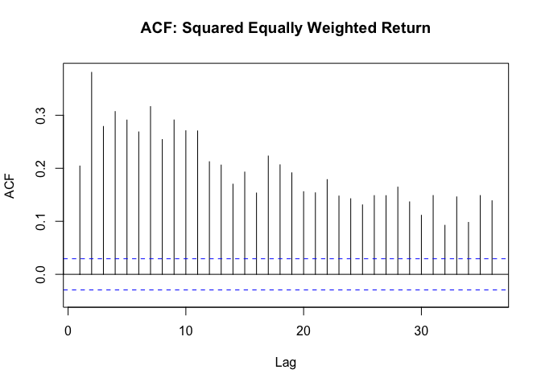

README
================

## Dispersion study

In the data folder, I give you the intra-day dispersion numbers for the
J200 (ALSI Top 40) and J400 (Swix top 40).

Also included is the weekly and 1 and 3 monthly calculated dispersion,
avg stock correlation and avg SD calcs for J200, J400, J300 and J430.
This is a treasure trove of data.

``` r
library(tidyverse)
```

    ## ── Attaching packages ─────────────────────────────────────── tidyverse 1.3.0 ──

    ## ✓ ggplot2 3.3.2     ✓ purrr   0.3.4
    ## ✓ tibble  3.0.4     ✓ dplyr   1.0.2
    ## ✓ tidyr   1.1.2     ✓ stringr 1.4.0
    ## ✓ readr   1.3.1     ✓ forcats 0.4.0

    ## ── Conflicts ────────────────────────────────────────── tidyverse_conflicts() ──
    ## x dplyr::filter() masks stats::filter()
    ## x dplyr::lag()    masks stats::lag()

``` r
# Intraday dispersion last 4 years:
ID_Disp <- read_rds("data/ID_Disp.rds") %>% filter(date >= as.Date("2016-07-29") & date <= as.Date("2020-07-31"))

ID_Disp %>% 
  ggplot() + 
  geom_line(aes(date, ID_Dispersion_W_J400)) + 
  geom_line(aes(date, ID_Dispersion_W_J200), color = "red")
```

<!-- -->

``` r
# Intraday weighted average realized volatility:
Ivol <- bind_rows(read_rds("data/J200_IVol.rds") %>% select(date, Avg_RV, W_Avg_RV = W_Avg_RV_J200) %>% mutate(Idx = "J200") %>% gather(Type, Value, -date, -Idx), 
                  read_rds("data/J400_IVol.rds") %>% select(date, Avg_RV, W_Avg_RV = W_Avg_RV_J400) %>% mutate(Idx = "J400") %>% gather(Type, Value, -date, -Idx))

Ivol %>% filter(Type == "W_Avg_RV") %>% 
  ggplot() + 
  geom_line(aes(date, Value, color = Idx)) + 
  labs(title = "Weighted Avg Realized Volatility") + theme_bw()
```

<!-- -->

``` r
# Dispersion - lower frequency
W_Dispersion <- 
  read_rds("data/Dispersion/Weekly.rds")
M_Dispersion <- 
  read_rds("data/Dispersion/Monthly.rds")
```

## Importing index returns data

``` r
library(tbl2xts)

# the JSE top 40 index used to create a simple return index

view(fmxdat::SA_Indexes)

TP40 <- fmxdat::SA_Indexes %>% filter(Tickers == "JSHR40TR Index") %>% 
    mutate(SimpleRet = Price / lag(Price)-1) %>% 
    ungroup() %>% select(date, SimpleRet) %>% tbl2xts::tbl_xts()

Plotdata <- cbind(TP40, TP40^2, abs(TP40))
colnames(Plotdata) <- c("Returns", "Returns_Sqd", "Returns_Abs")

Plotdata <- Plotdata %>% xts_tbl() %>% gather(ReturnType, Returns,-date) %>%
  filter(date >= as.Date("2016-07-29") & date <= as.Date("2020-07-31"))

ggplot(Plotdata) + geom_line(aes(x = date, y = Returns, colour = ReturnType, 
    alpha = 0.5)) + ggtitle("Return Type Persistence: TOP40TR Index") + 
    facet_wrap(~ReturnType, nrow = 3, ncol = 1, scales = "free") + 
    guides(alpha = FALSE, colour = FALSE) + theme_bw()
```

<!-- -->

# Estimating the GARCH

``` r
library(rugarch)
```

    ## Loading required package: parallel

    ## 
    ## Attaching package: 'rugarch'

    ## The following object is masked from 'package:purrr':
    ## 
    ##     reduce

    ## The following object is masked from 'package:stats':
    ## 
    ##     sigma

``` r
# combining the two datasets to make sure that they line up 

comb <- ID_Disp %>% select(date, ID_Dispersion_W_J400) %>%  left_join(xts_tbl(TP40), by="date") %>%
  tbl_xts() 

# plot dispersion against returns

comb %>% xts_tbl() %>% 
  ggplot() + 
  geom_line(aes(date, ID_Dispersion_W_J400), color = "steel blue") + 
  geom_line(aes(date, SimpleRet), color = "red")
```

<!-- -->

``` r
# remove the NAs - temporary solution 

comb[is.na(comb)] <- 0 

colSums(is.na(comb))
```

    ## ID_Dispersion_W_J400            SimpleRet 
    ##                    0                    0

``` r
fit <- comb[,2]


# first fit the simple model to returns 

garch1 <- ugarchspec(variance.model = list(model = c("sGARCH", 
    "gjrGARCH", "eGARCH", "fGARCH", "apARCH")[1], garchOrder = c(1, 
    1), external.regressors = NULL), mean.model = list(armaOrder = c(1, 0), include.mean = TRUE), 
    distribution.model = c("norm", "snorm", "std", "sstd", "ged","sged", "nig", "ghyp", "jsu")[1])

garchfit1 = ugarchfit(spec = garch1, data = fit)

print(garchfit1)
```

    ## 
    ## *---------------------------------*
    ## *          GARCH Model Fit        *
    ## *---------------------------------*
    ## 
    ## Conditional Variance Dynamics    
    ## -----------------------------------
    ## GARCH Model  : sGARCH(1,1)
    ## Mean Model   : ARFIMA(1,0,0)
    ## Distribution : norm 
    ## 
    ## Optimal Parameters
    ## ------------------------------------
    ##         Estimate  Std. Error  t value Pr(>|t|)
    ## mu      0.000535    0.000303  1.76425 0.077689
    ## ar1    -0.026491    0.034052 -0.77796 0.436595
    ## omega   0.000004    0.000003  1.18613 0.235572
    ## alpha1  0.110732    0.020194  5.48334 0.000000
    ## beta1   0.865822    0.026487 32.68904 0.000000
    ## 
    ## Robust Standard Errors:
    ##         Estimate  Std. Error  t value Pr(>|t|)
    ## mu      0.000535    0.000300  1.78385 0.074448
    ## ar1    -0.026491    0.032872 -0.80588 0.420310
    ## omega   0.000004    0.000012  0.30501 0.760362
    ## alpha1  0.110732    0.029263  3.78397 0.000154
    ## beta1   0.865822    0.074988 11.54618 0.000000
    ## 
    ## LogLikelihood : 3090.233 
    ## 
    ## Information Criteria
    ## ------------------------------------
    ##                     
    ## Akaike       -6.1766
    ## Bayes        -6.1521
    ## Shibata      -6.1767
    ## Hannan-Quinn -6.1673
    ## 
    ## Weighted Ljung-Box Test on Standardized Residuals
    ## ------------------------------------
    ##                         statistic p-value
    ## Lag[1]                     0.2543  0.6141
    ## Lag[2*(p+q)+(p+q)-1][2]    0.4203  0.9803
    ## Lag[4*(p+q)+(p+q)-1][5]    1.8024  0.7673
    ## d.o.f=1
    ## H0 : No serial correlation
    ## 
    ## Weighted Ljung-Box Test on Standardized Squared Residuals
    ## ------------------------------------
    ##                         statistic p-value
    ## Lag[1]                     0.3338 0.56344
    ## Lag[2*(p+q)+(p+q)-1][5]    4.6094 0.18723
    ## Lag[4*(p+q)+(p+q)-1][9]    8.5746 0.09918
    ## d.o.f=2
    ## 
    ## Weighted ARCH LM Tests
    ## ------------------------------------
    ##             Statistic Shape Scale P-Value
    ## ARCH Lag[3]    0.1026 0.500 2.000 0.74870
    ## ARCH Lag[5]    8.4738 1.440 1.667 0.01543
    ## ARCH Lag[7]   10.2115 2.315 1.543 0.01643
    ## 
    ## Nyblom stability test
    ## ------------------------------------
    ## Joint Statistic:  1.9737
    ## Individual Statistics:              
    ## mu     0.05157
    ## ar1    0.06420
    ## omega  0.63735
    ## alpha1 0.30490
    ## beta1  0.24645
    ## 
    ## Asymptotic Critical Values (10% 5% 1%)
    ## Joint Statistic:          1.28 1.47 1.88
    ## Individual Statistic:     0.35 0.47 0.75
    ## 
    ## Sign Bias Test
    ## ------------------------------------
    ##                    t-value   prob sig
    ## Sign Bias           0.8644 0.3876    
    ## Negative Sign Bias  0.3926 0.6947    
    ## Positive Sign Bias  0.9808 0.3269    
    ## Joint Effect        3.8894 0.2737    
    ## 
    ## 
    ## Adjusted Pearson Goodness-of-Fit Test:
    ## ------------------------------------
    ##   group statistic p-value(g-1)
    ## 1    20     29.53      0.05811
    ## 2    30     44.09      0.03596
    ## 3    40     44.40      0.25450
    ## 4    50     64.71      0.06559
    ## 
    ## 
    ## Elapsed time : 0.227942

``` r
# identifying the fit and external regressor for the model then fitting it to GARCH-X

exreg <- comb[,1]

garchx <- ugarchspec(variance.model = list(model = c("sGARCH", 
    "gjrGARCH", "eGARCH", "fGARCH", "apARCH")[1], garchOrder = c(1, 
    1), external.regressors = exreg), mean.model = list(armaOrder = c(1, 0), include.mean = TRUE), 
    distribution.model = c("norm", "snorm", "std", "sstd", "ged","sged", "nig", "ghyp", "jsu")[1])

# Now to fit the garch to the returns

garchfitx = ugarchfit(spec = garchx, data = fit)

garchfitx
```

    ## 
    ## *---------------------------------*
    ## *          GARCH Model Fit        *
    ## *---------------------------------*
    ## 
    ## Conditional Variance Dynamics    
    ## -----------------------------------
    ## GARCH Model  : sGARCH(1,1)
    ## Mean Model   : ARFIMA(1,0,0)
    ## Distribution : norm 
    ## 
    ## Optimal Parameters
    ## ------------------------------------
    ##         Estimate  Std. Error  t value Pr(>|t|)
    ## mu     -0.000757    0.000314  -2.4142 0.015770
    ## ar1    -0.036702    0.033726  -1.0882 0.276489
    ## omega   0.000000    0.000004   0.0000 1.000000
    ## alpha1  0.078654    0.036104   2.1785 0.029368
    ## beta1   0.198341    0.062180   3.1898 0.001424
    ## vxreg1  0.003904    0.000451   8.6571 0.000000
    ## 
    ## Robust Standard Errors:
    ##         Estimate  Std. Error  t value Pr(>|t|)
    ## mu     -0.000757    0.000368  -2.0554 0.039838
    ## ar1    -0.036702    0.031020  -1.1832 0.236739
    ## omega   0.000000    0.000002   0.0000 1.000000
    ## alpha1  0.078654    0.075884   1.0365 0.299971
    ## beta1   0.198341    0.119536   1.6593 0.097064
    ## vxreg1  0.003904    0.000889   4.3930 0.000011
    ## 
    ## LogLikelihood : 3121.685 
    ## 
    ## Information Criteria
    ## ------------------------------------
    ##                     
    ## Akaike       -6.2376
    ## Bayes        -6.2081
    ## Shibata      -6.2377
    ## Hannan-Quinn -6.2264
    ## 
    ## Weighted Ljung-Box Test on Standardized Residuals
    ## ------------------------------------
    ##                         statistic p-value
    ## Lag[1]                    0.01314  0.9087
    ## Lag[2*(p+q)+(p+q)-1][2]   0.05056  1.0000
    ## Lag[4*(p+q)+(p+q)-1][5]   3.25138  0.3707
    ## d.o.f=1
    ## H0 : No serial correlation
    ## 
    ## Weighted Ljung-Box Test on Standardized Squared Residuals
    ## ------------------------------------
    ##                         statistic   p-value
    ## Lag[1]                     0.5688 4.508e-01
    ## Lag[2*(p+q)+(p+q)-1][5]   48.8187 1.382e-13
    ## Lag[4*(p+q)+(p+q)-1][9]   75.5610 0.000e+00
    ## d.o.f=2
    ## 
    ## Weighted ARCH LM Tests
    ## ------------------------------------
    ##             Statistic Shape Scale   P-Value
    ## ARCH Lag[3]     9.965 0.500 2.000 1.596e-03
    ## ARCH Lag[5]    49.129 1.440 1.667 8.010e-13
    ## ARCH Lag[7]    58.516 2.315 1.543 3.553e-15
    ## 
    ## Nyblom stability test
    ## ------------------------------------
    ## Joint Statistic:  14.7888
    ## Individual Statistics:             
    ## mu     0.1613
    ## ar1    0.1008
    ## omega  5.5842
    ## alpha1 1.0499
    ## beta1  0.8486
    ## vxreg1 1.3700
    ## 
    ## Asymptotic Critical Values (10% 5% 1%)
    ## Joint Statistic:          1.49 1.68 2.12
    ## Individual Statistic:     0.35 0.47 0.75
    ## 
    ## Sign Bias Test
    ## ------------------------------------
    ##                    t-value    prob sig
    ## Sign Bias           1.9306 0.05381   *
    ## Negative Sign Bias  0.1105 0.91203    
    ## Positive Sign Bias  0.9277 0.35376    
    ## Joint Effect        4.6324 0.20078    
    ## 
    ## 
    ## Adjusted Pearson Goodness-of-Fit Test:
    ## ------------------------------------
    ##   group statistic p-value(g-1)
    ## 1    20     42.74     0.001406
    ## 2    30     54.48     0.002845
    ## 3    40     61.46     0.012368
    ## 4    50     66.32     0.050199
    ## 
    ## 
    ## Elapsed time : 0.382401

## Veiw the two conditional variance plots

``` r
# First for the garch-x
sigmax <- sigma(garchfitx) %>% xts_tbl()
colnames(sigmax) <- c("date", "sigma")
sigmax <- sigmax %>% mutate(date = as.Date(date))


ggplot() + geom_line(data = Plotdata %>% filter(ReturnType == 
    "Returns_Sqd") %>% select(date, Returns) %>% unique %>% mutate(Returns = sqrt(Returns)), 
    aes(x = date, y = Returns)) + geom_line(data = sigmax, aes(x = date, 
    y = sigma), color = "red", size = 2, alpha = 0.8) + theme_bw() + 
    # scale_y_continuous(limits = c(0, 0.35)) +
labs(title = "Comparison: Returns Sigma vs Sigma from Garch", 
    subtitle = "Note the smoothing effect of garch, as noise is controlled for.", 
    x = "", y = "Comparison of estimated volatility")
```

<!-- -->

``` r
# now for the garch

sigma <- sigma(garchfit1) %>% xts_tbl()
colnames(sigma) <- c("date", "sigma")
sigma <- sigma %>% mutate(date = as.Date(date))

ggplot() + geom_line(data = Plotdata %>% filter(ReturnType == 
    "Returns_Sqd") %>% select(date, Returns) %>% unique %>% mutate(Returns = sqrt(Returns)), 
    aes(x = date, y = Returns)) + geom_line(data = sigma, aes(x = date, 
    y = sigma), color = "red", size = 2, alpha = 0.8) + theme_bw() + 
    # scale_y_continuous(limits = c(0, 0.35)) +
labs(title = "Comparison: Returns Sigma vs Sigma from Garch", 
    subtitle = "Note the smoothing effect of garch, as noise is controlled for.", 
    x = "", y = "Comparison of estimated volatility")
```

<!-- -->

``` r
plot(garchfitx, which = 3)
```

<!-- -->

``` r
plot(garchfit1, which = 3)
```

<!-- -->

``` r
# testing the fit 

infocriteria(garchfit1)
```

    ##                       
    ## Akaike       -6.176643
    ## Bayes        -6.152085
    ## Shibata      -6.176693
    ## Hannan-Quinn -6.167309

``` r
infocriteria(garchfitx)
```

    ##                       
    ## Akaike       -6.237609
    ## Bayes        -6.208139
    ## Shibata      -6.237680
    ## Hannan-Quinn -6.226407

## forecast vol with the two models

``` r
garchfx <- ugarchforecast(garchfitx, n.ahead = 30)
garchf <- ugarchforecast(garchfit1, n.ahead = 5)

plot(garchfx, which = 1)
```

<!-- -->

``` r
plot(garchf, which = 1)
```

<!-- -->

``` r
# rolling forecast

cl <- makePSOCKcluster(10)
spec <- ugarchspec(variance.model = list(model = "sGARCH", garchOrder = c(1, 
    1), external.regressors = NULL), mean.model = list(armaOrder = c(1, 0), include.mean = TRUE), 
    distribution = "norm")
# Thus the model spec is a ARIMA(1,1,0)-GJRGARCH(1,1), with
# normal distribution

roll <- ugarchroll(spec, fit, forecast.length = 500, refit.every = 50, 
    refit.window = "moving", window.size = 1000, calculate.VaR = TRUE, 
    VaR.alpha = c(0.01, 0.05), keep.coef = TRUE, cluster = cl)

# For this, only 1-step ahead can be done automatically.
show(roll)
```

    ## 
    ## *-------------------------------------*
    ## *              GARCH Roll             *
    ## *-------------------------------------*
    ## No.Refits        : 10
    ## Refit Horizon    : 50
    ## No.Forecasts : 500
    ## GARCH Model      : sGARCH(1,1)
    ## Distribution : norm 
    ## 
    ## Forecast Density:
    ##               Mu  Sigma Skew Shape Shape(GIG) Realized
    ## 2018-07-31 6e-04 0.0113    0     0          0   0.0009
    ## 2018-08-01 6e-04 0.0109    0     0          0   0.0005
    ## 2018-08-02 6e-04 0.0106    0     0          0  -0.0203
    ## 2018-08-03 7e-04 0.0115    0     0          0   0.0134
    ## 2018-08-06 6e-04 0.0115    0     0          0  -0.0055
    ## 2018-08-07 7e-04 0.0113    0     0          0   0.0160
    ## 
    ## ..........................
    ##               Mu  Sigma Skew Shape Shape(GIG) Realized
    ## 2020-07-24 5e-04 0.0104    0     0          0  -0.0126
    ## 2020-07-27 7e-04 0.0108    0     0          0   0.0118
    ## 2020-07-28 4e-04 0.0109    0     0          0   0.0071
    ## 2020-07-29 4e-04 0.0105    0     0          0   0.0052
    ## 2020-07-30 5e-04 0.0101    0     0          0  -0.0177
    ## 2020-07-31 7e-04 0.0114    0     0          0  -0.0045
    ## 
    ## Elapsed: 16.48675 secs

``` r
report(roll, type = "fpm")
```

    ## 
    ## GARCH Roll Mean Forecast Performance Measures
    ## ---------------------------------------------
    ## Model        : sGARCH
    ## No.Refits    : 10
    ## No.Forecasts: 500
    ## 
    ##         Stats
    ## MSE 0.0002501
    ## MAE 0.0106900
    ## DAC 0.5060000
