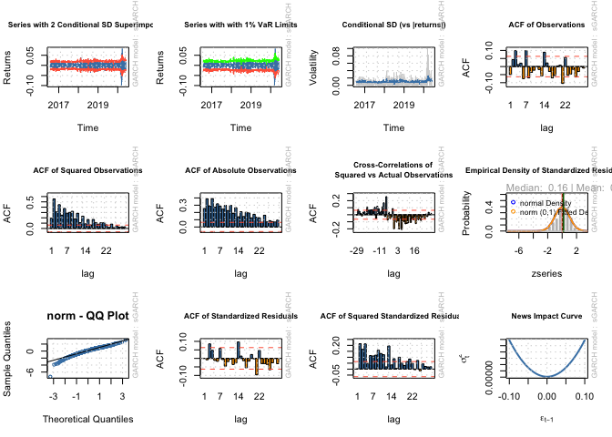

README
================

## Dispersion study

In the data folder, I give you the intra-day dispersion numbers for the
J200 (ALSI Top 40) and J400 (Swix top 40).

Also included is the weekly and 1 and 3 monthly calculated dispersion,
avg stock correlation and avg SD calcs for J200, J400, J300 and J430.
This is a treasure trove of data.

``` r
library(rmsfuns)
library(fmxdat)
if (!require(robustbase)) install.packages("robustbase")
```

    ## Loading required package: robustbase

``` r
load_pkg(c("tidyverse", "devtools", "rugarch", "forecast", "tbl2xts", 
    "lubridate", "PerformanceAnalytics", "ggthemes"))
```

    ## ── Attaching packages ─────────────────────────────────────── tidyverse 1.3.0 ──

    ## ✓ ggplot2 3.3.2     ✓ purrr   0.3.4
    ## ✓ tibble  3.0.4     ✓ dplyr   1.0.2
    ## ✓ tidyr   1.1.2     ✓ stringr 1.4.0
    ## ✓ readr   1.3.1     ✓ forcats 0.4.0

    ## ── Conflicts ────────────────────────────────────────── tidyverse_conflicts() ──
    ## x dplyr::filter() masks stats::filter()
    ## x dplyr::lag()    masks stats::lag()

    ## Loading required package: usethis

    ## Loading required package: parallel

    ## 
    ## Attaching package: 'rugarch'

    ## The following object is masked from 'package:purrr':
    ## 
    ##     reduce

    ## The following object is masked from 'package:stats':
    ## 
    ##     sigma

    ## Registered S3 method overwritten by 'quantmod':
    ##   method            from
    ##   as.zoo.data.frame zoo

    ## 
    ## Attaching package: 'lubridate'

    ## The following object is masked from 'package:base':
    ## 
    ##     date

    ## Loading required package: xts

    ## Loading required package: zoo

    ## 
    ## Attaching package: 'zoo'

    ## The following objects are masked from 'package:base':
    ## 
    ##     as.Date, as.Date.numeric

    ## 
    ## Attaching package: 'xts'

    ## The following objects are masked from 'package:dplyr':
    ## 
    ##     first, last

    ## 
    ## Attaching package: 'PerformanceAnalytics'

    ## The following object is masked from 'package:graphics':
    ## 
    ##     legend

``` r
library(tidyverse)
```

``` r
# Intraday dispersion last 4 years:
ID_Disp <- read_rds("data/ID_Disp.rds") %>% filter(date >= as.Date("2016-07-29") & date <= as.Date("2020-07-31"))

ID_Disp %>% 
  ggplot() + 
  geom_line(aes(date, ID_Dispersion_W_J400)) + 
  geom_line(aes(date, ID_Dispersion_W_J200), color = "red")
```

<!-- -->

``` r
# Intraday weighted average realized volatility:
Ivol <- bind_rows(read_rds("data/J200_IVol.rds") %>% select(date, Avg_RV, W_Avg_RV = W_Avg_RV_J200) %>% mutate(Idx = "J200") %>% gather(Type, Value, -date, -Idx), 
                  read_rds("data/J400_IVol.rds") %>% select(date, Avg_RV, W_Avg_RV = W_Avg_RV_J400) %>% mutate(Idx = "J400") %>% gather(Type, Value, -date, -Idx))

Ivol %>% filter(Type == "W_Avg_RV") %>% 
  ggplot() + 
  geom_line(aes(date, Value, color = Idx)) + 
  labs(title = "Weighted Avg Realized Volatility") + theme_bw()
```

<!-- -->

``` r
# Dispersion - lower frequency
W_Dispersion <- 
  read_rds("data/Dispersion/Weekly.rds")
M_Dispersion <- 
  read_rds("data/Dispersion/Monthly.rds")
```

## Importing index returns data

The returns data used to construct the

``` r
library(tbl2xts)

# the JSE top 40 index used to create a simple return index

TP40 <- fmxdat::SA_Indexes %>% filter(Tickers == "JSHRALTR Index") %>% 
    mutate(SimpleRet = Price / lag(Price)-1) %>% 
    ungroup() %>% select(date, SimpleRet) %>% tbl2xts::tbl_xts()

Plotdata <- cbind(TP40, TP40^2, abs(TP40))
colnames(Plotdata) <- c("Returns", "Returns_Sqd", "Returns_Abs")

Plotdata <- Plotdata %>% xts_tbl() %>% gather(ReturnType, Returns,-date) %>%
  filter(date >= as.Date("2016-07-29") & date <= as.Date("2020-07-31"))

ggplot(Plotdata) + geom_line(aes(x = date, y = Returns, colour = ReturnType, 
    alpha = 0.5)) + ggtitle("Return Type Persistence: TOP40TR Index") + 
    facet_wrap(~ReturnType, nrow = 3, ncol = 1, scales = "free") + 
    guides(alpha = FALSE, colour = FALSE) + theme_bw()
```

<!-- -->

## tests

``` r
forecast::Acf(TP40, main = "ACF: Equally Weighted Return")
```

<!-- -->

``` r
forecast::Acf(TP40^2, main = "ACF: Squared Equally Weighted Return")
```

<!-- -->

``` r
forecast::Acf(abs(TP40), main = "ACF: Absolute Equally Weighted Return")
```

<!-- -->

These test prove that there is conditional heteroskedasticity in the
data - there is volatility is clustering.

``` r
Box.test(coredata(TP40^2), type = "Ljung-Box", lag = 12)
```

    ## 
    ##  Box-Ljung test
    ## 
    ## data:  coredata(TP40^2)
    ## X-squared = 4772.6, df = 12, p-value < 2.2e-16

# Estimating the GARCH

``` r
library(rugarch)

# combining the two datasets to make sure that they line up 

comb <- ID_Disp %>% select(date, ID_Dispersion_W_J400) %>%  left_join(xts_tbl(TP40), by="date") %>%
  tbl_xts() 

# plot dispersion against returns

comb %>% xts_tbl() %>% 
  ggplot() + 
  geom_line(aes(date, ID_Dispersion_W_J400), color = "steel blue") + 
  geom_line(aes(date, SimpleRet), color = "red")
```

<!-- -->

``` r
# remove the NAs - temporary solution 

comb[is.na(comb)] <- 0 

colSums(is.na(comb))
```

    ## ID_Dispersion_W_J400            SimpleRet 
    ##                    0                    0

``` r
fit <- comb[,2]


# first fit the simple model to returns 

garch1 <- ugarchspec(variance.model = list(model = c("sGARCH", 
    "gjrGARCH", "eGARCH", "fGARCH", "apARCH")[1], garchOrder = c(1, 
    1), external.regressors = NULL), mean.model = list(armaOrder = c(1, 0), include.mean = TRUE), 
    distribution.model = c("norm", "snorm", "std", "sstd", "ged","sged", "nig", "ghyp", "jsu")[1])

garchfit1 = ugarchfit(spec = garch1, data = fit)

garchfit1
```

    ## 
    ## *---------------------------------*
    ## *          GARCH Model Fit        *
    ## *---------------------------------*
    ## 
    ## Conditional Variance Dynamics    
    ## -----------------------------------
    ## GARCH Model  : sGARCH(1,1)
    ## Mean Model   : ARFIMA(1,0,0)
    ## Distribution : norm 
    ## 
    ## Optimal Parameters
    ## ------------------------------------
    ##         Estimate  Std. Error  t value Pr(>|t|)
    ## mu      0.000447    0.000275  1.62563  0.10403
    ## ar1    -0.017196    0.034305 -0.50126  0.61619
    ## omega   0.000003    0.000003  1.23787  0.21576
    ## alpha1  0.117497    0.021593  5.44140  0.00000
    ## beta1   0.857182    0.027439 31.23900  0.00000
    ## 
    ## Robust Standard Errors:
    ##         Estimate  Std. Error  t value Pr(>|t|)
    ## mu      0.000447    0.000273  1.63828 0.101362
    ## ar1    -0.017196    0.033075 -0.51990 0.603132
    ## omega   0.000003    0.000011  0.30422 0.760961
    ## alpha1  0.117497    0.034836  3.37291 0.000744
    ## beta1   0.857182    0.081158 10.56194 0.000000
    ## 
    ## LogLikelihood : 3188.439 
    ## 
    ## Information Criteria
    ## ------------------------------------
    ##                     
    ## Akaike       -6.3733
    ## Bayes        -6.3487
    ## Shibata      -6.3733
    ## Hannan-Quinn -6.3639
    ## 
    ## Weighted Ljung-Box Test on Standardized Residuals
    ## ------------------------------------
    ##                         statistic p-value
    ## Lag[1]                     0.2829  0.5948
    ## Lag[2*(p+q)+(p+q)-1][2]    0.3813  0.9861
    ## Lag[4*(p+q)+(p+q)-1][5]    1.3553  0.8804
    ## d.o.f=1
    ## H0 : No serial correlation
    ## 
    ## Weighted Ljung-Box Test on Standardized Squared Residuals
    ## ------------------------------------
    ##                         statistic p-value
    ## Lag[1]                     0.6879  0.4069
    ## Lag[2*(p+q)+(p+q)-1][5]    4.5836  0.1897
    ## Lag[4*(p+q)+(p+q)-1][9]    7.8078  0.1404
    ## d.o.f=2
    ## 
    ## Weighted ARCH LM Tests
    ## ------------------------------------
    ##             Statistic Shape Scale P-Value
    ## ARCH Lag[3]    0.3474 0.500 2.000 0.55556
    ## ARCH Lag[5]    7.6439 1.440 1.667 0.02444
    ## ARCH Lag[7]    9.0181 2.315 1.543 0.03096
    ## 
    ## Nyblom stability test
    ## ------------------------------------
    ## Joint Statistic:  3.0036
    ## Individual Statistics:              
    ## mu     0.04608
    ## ar1    0.07010
    ## omega  0.91139
    ## alpha1 0.33982
    ## beta1  0.27512
    ## 
    ## Asymptotic Critical Values (10% 5% 1%)
    ## Joint Statistic:          1.28 1.47 1.88
    ## Individual Statistic:     0.35 0.47 0.75
    ## 
    ## Sign Bias Test
    ## ------------------------------------
    ##                    t-value   prob sig
    ## Sign Bias           1.1056 0.2692    
    ## Negative Sign Bias  0.5436 0.5868    
    ## Positive Sign Bias  0.8752 0.3817    
    ## Joint Effect        4.2942 0.2314    
    ## 
    ## 
    ## Adjusted Pearson Goodness-of-Fit Test:
    ## ------------------------------------
    ##   group statistic p-value(g-1)
    ## 1    20     30.93      0.04109
    ## 2    30     34.54      0.21992
    ## 3    40     45.44      0.22137
    ## 4    50     57.01      0.20186
    ## 
    ## 
    ## Elapsed time : 0.371305

``` r
# identifying the fit and external regressor for the model then fitting it to GARCH-X

exreg <- comb[,1]

garchx <- ugarchspec(variance.model = list(model = c("sGARCH", 
    "gjrGARCH", "eGARCH", "fGARCH", "apARCH")[1], garchOrder = c(1, 
    1), external.regressors = exreg), mean.model = list(armaOrder = c(1, 0), include.mean = TRUE), 
    distribution.model = c("norm", "snorm", "std", "sstd", "ged","sged", "nig", "ghyp", "jsu")[1])

# Now to fit the garch to the returns

garchfitx = ugarchfit(spec = garchx, data = fit)

garchfitx
```

    ## 
    ## *---------------------------------*
    ## *          GARCH Model Fit        *
    ## *---------------------------------*
    ## 
    ## Conditional Variance Dynamics    
    ## -----------------------------------
    ## GARCH Model  : sGARCH(1,1)
    ## Mean Model   : ARFIMA(1,0,0)
    ## Distribution : norm 
    ## 
    ## Optimal Parameters
    ## ------------------------------------
    ##         Estimate  Std. Error  t value Pr(>|t|)
    ## mu     -0.000528    0.000314 -1.68227 0.092517
    ## ar1    -0.019763    0.035429 -0.55781 0.576973
    ## omega   0.000000    0.000003  0.00000 1.000000
    ## alpha1  0.129395    0.035706  3.62391 0.000290
    ## beta1   0.317872    0.097413  3.26315 0.001102
    ## vxreg1  0.002483    0.000508  4.88858 0.000001
    ## 
    ## Robust Standard Errors:
    ##         Estimate  Std. Error  t value Pr(>|t|)
    ## mu     -0.000528    0.000775 -0.68106  0.49584
    ## ar1    -0.019763    0.034241 -0.57717  0.56383
    ## omega   0.000000    0.000004  0.00000  1.00000
    ## alpha1  0.129395    0.130018  0.99521  0.31964
    ## beta1   0.317872    0.463322  0.68607  0.49267
    ## vxreg1  0.002483    0.002402  1.03357  0.30134
    ## 
    ## LogLikelihood : 3213.308 
    ## 
    ## Information Criteria
    ## ------------------------------------
    ##                     
    ## Akaike       -6.4210
    ## Bayes        -6.3916
    ## Shibata      -6.4211
    ## Hannan-Quinn -6.4098
    ## 
    ## Weighted Ljung-Box Test on Standardized Residuals
    ## ------------------------------------
    ##                         statistic p-value
    ## Lag[1]                    0.02323  0.8789
    ## Lag[2*(p+q)+(p+q)-1][2]   0.05945  1.0000
    ## Lag[4*(p+q)+(p+q)-1][5]   2.80823  0.4811
    ## d.o.f=1
    ## H0 : No serial correlation
    ## 
    ## Weighted Ljung-Box Test on Standardized Squared Residuals
    ## ------------------------------------
    ##                         statistic   p-value
    ## Lag[1]                      1.466 2.259e-01
    ## Lag[2*(p+q)+(p+q)-1][5]    35.735 7.552e-10
    ## Lag[4*(p+q)+(p+q)-1][9]    54.245 6.184e-14
    ## d.o.f=2
    ## 
    ## Weighted ARCH LM Tests
    ## ------------------------------------
    ##             Statistic Shape Scale   P-Value
    ## ARCH Lag[3]     14.15 0.500 2.000 1.689e-04
    ## ARCH Lag[5]     38.86 1.440 1.667 3.439e-10
    ## ARCH Lag[7]     45.41 2.315 1.543 1.251e-11
    ## 
    ## Nyblom stability test
    ## ------------------------------------
    ## Joint Statistic:  57.2025
    ## Individual Statistics:               
    ## mu      0.10308
    ## ar1     0.06806
    ## omega  12.73037
    ## alpha1  1.29423
    ## beta1   1.18417
    ## vxreg1  1.37848
    ## 
    ## Asymptotic Critical Values (10% 5% 1%)
    ## Joint Statistic:          1.49 1.68 2.12
    ## Individual Statistic:     0.35 0.47 0.75
    ## 
    ## Sign Bias Test
    ## ------------------------------------
    ##                    t-value    prob sig
    ## Sign Bias           2.0580 0.03985  **
    ## Negative Sign Bias  0.4060 0.68484    
    ## Positive Sign Bias  0.5101 0.61012    
    ## Joint Effect        5.2681 0.15318    
    ## 
    ## 
    ## Adjusted Pearson Goodness-of-Fit Test:
    ## ------------------------------------
    ##   group statistic p-value(g-1)
    ## 1    20     40.50     0.002812
    ## 2    30     47.40     0.016962
    ## 3    40     59.30     0.019611
    ## 4    50     82.23     0.002063
    ## 
    ## 
    ## Elapsed time : 0.4280658

## Veiw the two conditional variance plots

``` r
# First for the garch-x
sigmax <- sigma(garchfitx) %>% xts_tbl()
colnames(sigmax) <- c("date", "sigma")
sigmax <- sigmax %>% mutate(date = as.Date(date))


ggplot() + geom_line(data = Plotdata %>% filter(ReturnType == 
    "Returns_Sqd") %>% select(date, Returns) %>% unique %>% mutate(Returns = sqrt(Returns)), 
    aes(x = date, y = Returns)) + geom_line(data = sigmax, aes(x = date, 
    y = sigma), color = "red", size = 1, alpha = 0.8) + theme_bw() + 
    # scale_y_continuous(limits = c(0, 0.35)) +
labs(title = "Comparison: Returns Sigma vs Sigma from Garch-x", 
    subtitle = "Note the smoothing effect of garch, as noise is controlled for.", 
    x = "", y = "Comparison of estimated volatility")
```

<!-- -->

``` r
# now for the garch

sigma <- sigma(garchfit1) %>% xts_tbl()
colnames(sigma) <- c("date", "sigma")
sigma <- sigma %>% mutate(date = as.Date(date))

ggplot() + geom_line(data = Plotdata %>% filter(ReturnType == 
    "Returns_Sqd") %>% select(date, Returns) %>% unique %>% mutate(Returns = sqrt(Returns)), 
    aes(x = date, y = Returns)) + geom_line(data = sigma, aes(x = date, 
    y = sigma), color = "red", size = 1, alpha = 0.8) + theme_bw() + 
    # scale_y_continuous(limits = c(0, 0.35)) +
labs(title = "Comparison: Returns Sigma vs Sigma from Garch", 
    subtitle = "Note the smoothing effect of garch, as noise is controlled for.", 
    x = "", y = "Comparison of estimated volatility")
```

<!-- -->

``` r
plot(garchfitx, which = 3)
```

<!-- -->

``` r
plot(garchfit1, which = 3)
```

<!-- -->

``` r
# testing the fit 

infocriteria(garchfit1)
```

    ##                       
    ## Akaike       -6.373251
    ## Bayes        -6.348693
    ## Shibata      -6.373301
    ## Hannan-Quinn -6.363917

``` r
infocriteria(garchfitx)
```

    ##                       
    ## Akaike       -6.421037
    ## Bayes        -6.391567
    ## Shibata      -6.421109
    ## Hannan-Quinn -6.409836

## forecast vol with the two models

``` r
garchfx <- ugarchforecast(garchfitx, n.ahead = 30)
garchf <- ugarchforecast(garchfit1, n.ahead = 30)

plot(garchfx, which = 1)
```

<!-- -->

``` r
plot(garchf, which = 1)
```

<!-- -->

``` r
plot(garchfx, which = 3)
```

<!-- -->

``` r
plot(garchf, which = 3)
```

<!-- -->

``` r
# rolling forecast

cl <- makePSOCKcluster(10)
# Thus the model spec is a ARIMA(1,1,0)-GJRGARCH(1,1), with
# normal distribution

roll <- ugarchroll(garch1, fit, forecast.length = 500, refit.every = 50, 
    refit.window = "moving", window.size = 1000, calculate.VaR = TRUE, 
    VaR.alpha = c(0.01, 0.05), keep.coef = TRUE, cluster = cl)

# For this, only 1-step ahead can be done automatically.
show(roll)
```

    ## 
    ## *-------------------------------------*
    ## *              GARCH Roll             *
    ## *-------------------------------------*
    ## No.Refits        : 10
    ## Refit Horizon    : 50
    ## No.Forecasts : 500
    ## GARCH Model      : sGARCH(1,1)
    ## Distribution : norm 
    ## 
    ## Forecast Density:
    ##               Mu  Sigma Skew Shape Shape(GIG) Realized
    ## 2018-07-31 5e-04 0.0100    0     0          0   0.0014
    ## 2018-08-01 5e-04 0.0097    0     0          0   0.0008
    ## 2018-08-02 5e-04 0.0094    0     0          0  -0.0175
    ## 2018-08-03 4e-04 0.0101    0     0          0   0.0118
    ## 2018-08-06 6e-04 0.0102    0     0          0  -0.0060
    ## 2018-08-07 5e-04 0.0100    0     0          0   0.0149
    ## 
    ## ..........................
    ##               Mu  Sigma Skew Shape Shape(GIG) Realized
    ## 2020-07-24 4e-04 0.0093    0     0          0  -0.0112
    ## 2020-07-27 5e-04 0.0097    0     0          0   0.0111
    ## 2020-07-28 4e-04 0.0098    0     0          0   0.0070
    ## 2020-07-29 4e-04 0.0096    0     0          0   0.0052
    ## 2020-07-30 4e-04 0.0092    0     0          0  -0.0175
    ## 2020-07-31 5e-04 0.0107    0     0          0  -0.0050
    ## 
    ## Elapsed: 16.94278 secs

``` r
report(roll, type = "fpm")
```

    ## 
    ## GARCH Roll Mean Forecast Performance Measures
    ## ---------------------------------------------
    ## Model        : sGARCH
    ## No.Refits    : 10
    ## No.Forecasts: 500
    ## 
    ##         Stats
    ## MSE 0.0002235
    ## MAE 0.0098640
    ## DAC 0.5180000

``` r
# Thus the model spec is a ARIMA(1,1,0)-GJRGARCH(1,1), with
# normal distribution

rollx <- ugarchroll(garchx, fit, forecast.length = 500, refit.every = 50, 
    refit.window = "moving", window.size = 1000, calculate.VaR = TRUE, 
    VaR.alpha = c(0.01, 0.05), keep.coef = TRUE, cluster = cl)

# For this, only 1-step ahead can be done automatically.
show(rollx)
```

    ## 
    ## *-------------------------------------*
    ## *              GARCH Roll             *
    ## *-------------------------------------*
    ## No.Refits        : 10
    ## Refit Horizon    : 50
    ## No.Forecasts : 500
    ## GARCH Model      : sGARCH(1,1)
    ## Distribution : norm 
    ## 
    ## Forecast Density:
    ##                Mu  Sigma Skew Shape Shape(GIG) Realized
    ## 2018-07-31 -6e-04 0.0094    0     0          0   0.0014
    ## 2018-08-01 -6e-04 0.0076    0     0          0   0.0008
    ## 2018-08-02 -6e-04 0.0078    0     0          0  -0.0175
    ## 2018-08-03 -9e-04 0.0094    0     0          0   0.0118
    ## 2018-08-06 -4e-04 0.0075    0     0          0  -0.0060
    ## 2018-08-07 -7e-04 0.0096    0     0          0   0.0149
    ## 
    ## ..........................
    ##                Mu  Sigma Skew Shape Shape(GIG) Realized
    ## 2020-07-24 -5e-04 0.0099    0     0          0  -0.0112
    ## 2020-07-27 -5e-04 0.0113    0     0          0   0.0111
    ## 2020-07-28 -6e-04 0.0108    0     0          0   0.0070
    ## 2020-07-29 -6e-04 0.0112    0     0          0   0.0052
    ## 2020-07-30 -6e-04 0.0096    0     0          0  -0.0175
    ## 2020-07-31 -4e-04 0.0114    0     0          0  -0.0050
    ## 
    ## Elapsed: 3.010165 secs

``` r
report(rollx, type = "fpm")
```

    ## 
    ## GARCH Roll Mean Forecast Performance Measures
    ## ---------------------------------------------
    ## Model        : sGARCH
    ## No.Refits    : 10
    ## No.Forecasts: 500
    ## 
    ##         Stats
    ## MSE 0.0002233
    ## MAE 0.0099000
    ## DAC 0.4820000

``` r
report(roll, type = "fpm")
```

    ## 
    ## GARCH Roll Mean Forecast Performance Measures
    ## ---------------------------------------------
    ## Model        : sGARCH
    ## No.Refits    : 10
    ## No.Forecasts: 500
    ## 
    ##         Stats
    ## MSE 0.0002235
    ## MAE 0.0098640
    ## DAC 0.5180000
